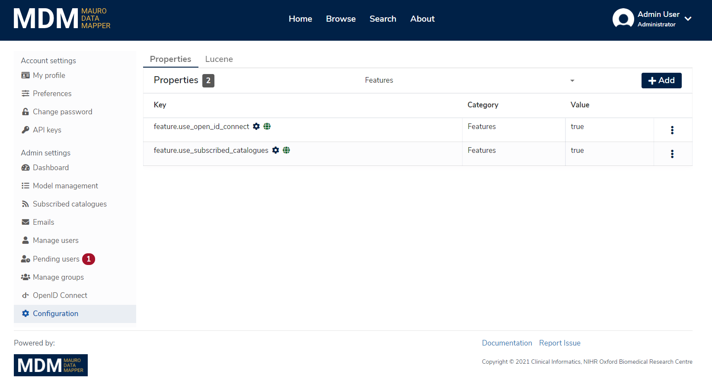

## Introduction

This user guide will walk you through the management and purpose of _feature switches_.

!!! Note
    Only administrators can view and control feature switches in the Mauro user interface.

## What are feature switches?

_Feature switches_ in the Mauro user interface allow an administrator to control which particular feature sets are enabled and visible to users of the Mauro instance running. There are several reasons why feature switches may be used:

1. There are some feature sets in the user interface which are optional or depend on certain plugins or instance configuration to work. 
2. Some Mauro instances may not need particular functionality in daily running.
3. There may be features in active development, still experimental or subject to change.

In these cases, an administrator is able to switch on or off feature sets that are required or not needed, depending on the requirements of that Mauro instance.

## Administration

Feature switches are controlled via the [Configuration](../../admin-functionality/admin-functionality#7-configuration) panel using Mauro [API properties](../../../rest-api/admin/#properties).

All feature switches are:

1. Categorised under **Features**.
2. Publicly available to any user for reading (but not updating).

To add a feature switch and control feature visibility:

1. Select **'Configuration'** from the user profile dropdown menu.
2. Under the **'Properties'** tab, either click on **'+ Add'**.
3. Under **'Property to add'**, select any key from the list that starts with **'feature.'**
4. Under **'Value'**, select either **'Yes'** or **'No'** to enable or disable the feature respectively.
5. Click **'Add property'** to save your changes.

## Available features

The table below lists all the optional features that can be controlled by feature switches.

!!! Warning
    It is advisable that any feature switches marked as **'In development'** should only be used in test environments until fully completed.

<table style="width: 100%;">
    <thead>
        <tr>
            <th style="width: 85%;"><b>Feature switch</b></th>
            <th style="width: 15%;"><b>Default value</b></th>
        </tr>
    </thead>
    <tbody>
        <tr>
            <td>
                <code>feature.use_subscribed_catalogues</code>
                

                    Enables the <a href="/user-guides/publish-subscribe/publish-subscribe">Subscribed Catalogues and Federated Data Models</a> feature set.
                

            </td>
            <td><code>true</code></td>
        </tr>
        <tr>
            <td>
                <code>feature.use_open_id_connect</code>
                
<b>In development</b>

                

                    Enables the user interface for administrators to create/edit/remove OpenID Connect provider details to Mauro, and
                    for the login form to list these external identity providers to redirect and login.                    
                

                

                    As well as enabling this feature switch, you must also install the <a href="/installing/plugins/">Mauro OpenID Connect authentication</a>
                    plugin for the Mauro instance too.
                

            </td>
            <td><code>false</code></td>
        </tr>
        <tr>
            <td>
                <code>feature.use_versioned_folders</code>
                
<b>In development</b>

                

                    Enables the ability to use <em>Versioned Folders</em>.
                

            </td>
            <td><code>false</code></td>
        </tr>
        <tr>
            <td>
                <code>feature.use_merge_diff_ui</code>
                
<b>In development</b>

                

                    Enables a new user interface for the management of merging data models within the Mauro user interface.
                

            </td>
            <td><code>false</code></td>
        </tr>        
    </tbody>
</table>