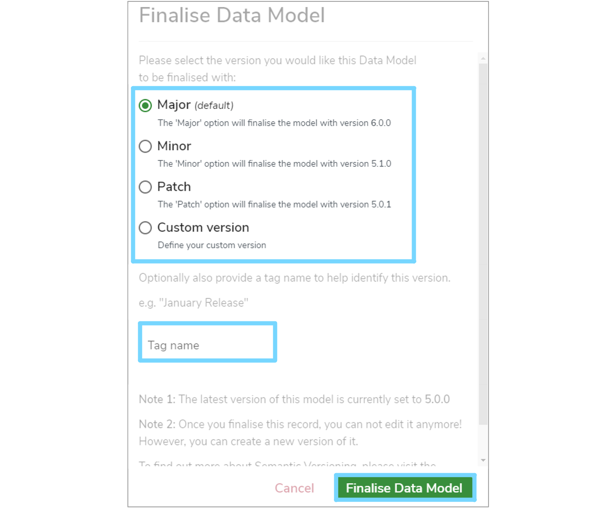

This user guide explains how to finalise catalogue items such as **Versioned Folders** and [Data Models](../../glossary/data-model/data-model.md).

---

## 1. Overview

**Finalising** a **Data Model** means that the model if fixed to a specific version and cannot be modified further. Therefore, all the contents of that model are now **read only**. This ensures that the model represents a final state that will remain as it is forever. However, a finalised **Data Model** can be modified further by creating a new **Version**.

---
## 2. Criteria

The following catalogue items can be **Finalised**:

* Data Models
* Terminologies
* Code Sets
* Reference Data Models
* Versioned Folders

Any of the catalogue items above may be **Finalised**, so long as they are:

* In their **Draft** state
* On their **main** branch

### 2.1 Finalising a Versioned Folder

When **Finalising** a **Versioned Folder**, this means that every model within this folder is also **Finalised** as well. This is shown in the **Model Tree** by a document symbol and a version number, with **'Finalised'** to the right of the model's name in the details panel.  

The same version number for the **Versioned Folder** is automatically assigned to the models within that folder. Version numbers cannot be customised individually on model's within a **Versioned Folder**.

However, a **Data Model** within a **Versioned Folder** cannot be individually **Finalised** as it is version controlled by it's parent folder. Therefore, only when the **Versioned Folder** is **Finalised** will the model within it become **Finalised** too.

---

## 3. How to Finalise an item

To finalise a catalogue item, first select it in the **Model Tree**. Once the item's details panel is displayed on the right, click the three vertical dot menu at the top right of the details panel. Select **'Finalise'** from the dropdown menu.

A **'Finalise Data Model'** dialogue box will then appear where you will have several options for choosing the next version number. 

* **Major**  
	Represents a major change to the item. For example, restructuring the model.

* **Minor**  
	Represents a minor change to the item. For example, editing the description of a model.

* **Patch**  
	Represents very minor changes or fixes to the item. For example, correcting spelling mistakes.
	
* **Custom**  
	If the automatic version number above is not sufficient, select this option to manually enter your own.

	
You then have the option to enter a **'Tag name'** to attach to this **Finalised** version. This is useful if you want to apply additional context alongside the version number. For example, **'January 2021 Release'**, **'Interim Release'** or **'Modelling Milestone'**.

Once you've completed the form, click **'Finalise Data Model'** to confirm your changes and a green notification box should appear at the bottom right of your screen confirming that the **'Data Model finalised successfully'**. 

The item is now in a **Finalised** state, and the version number chosen will now be attached to the item.

---