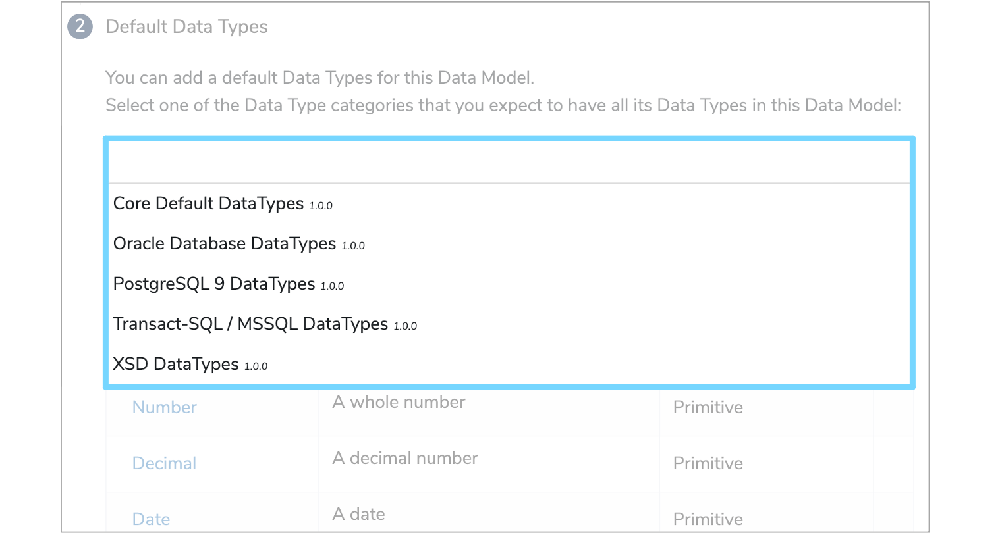
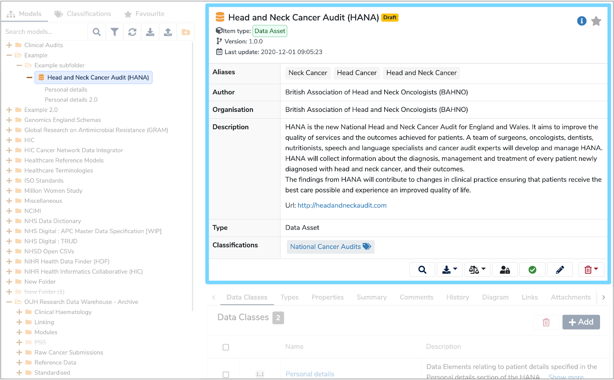

## **1. Create a folder**
To create a new Data Model, first you need to create a folder.
Click the **'Create a new Folder'** icon at the top right of the Finder Panel. Enter a Folder name and click **'Add folder'**. Your new folder should now appear in the Model Tree.

## **2. Add Data Model**
To add a Data Model, right click your new folder and select **'Add Data Model'**. A **'New Data Model'** form should appear on the right. 

## **3. Complete New Data Model form**

Please complete both the mandatory and optional fields on the New Data Model form, with the defintions of each field detailed below:

* **Label**  
	This is the name you want to give your new Data Model and will appear in the Finder Panel. Please include any asset version information, as two models cannot have the same label.
 
* **Author**  
	Enter the name(s) of the authors of the model, or alternatively, the underlying data asset or standard.

* **Organisation**  
	This is the name of the organisation responsible for the documentation, or the underlying data asset or standard.

* **Description**  
	Enter a detailed description of the data asset or standard and include information that would be useful to users who are unfamiliar with this data.

* **Type**  
	Select whether this model is a **'Data Asset'** or a **'Data Standard'** from the dropdown menu. A **Data Asset** is a collection of pre-existing data such as a database or a number of completed forms. While a **Data Standard** is a template for data that is to be colleced such as a form or schema.

* **Classifier**  
	Enter the relevant classifier by either selecting from the existing list in the dropdown menu, or by typing a name to create a new classifier. You may enter multiple classifiers.

Once all the fields have been populated click **'Next Step'**. 

## **4. Select Default Data Type**

Now you need to select the relevant **'Default Data Type'** from the dropdown menu. Select a category that you expect to have all its data types within your Data Model.

## **5. Submit Data Model**
Once completed, click **'Submit Data Model'** and your new Data Model will be added to your folder and will appear in the Finder Panel.

