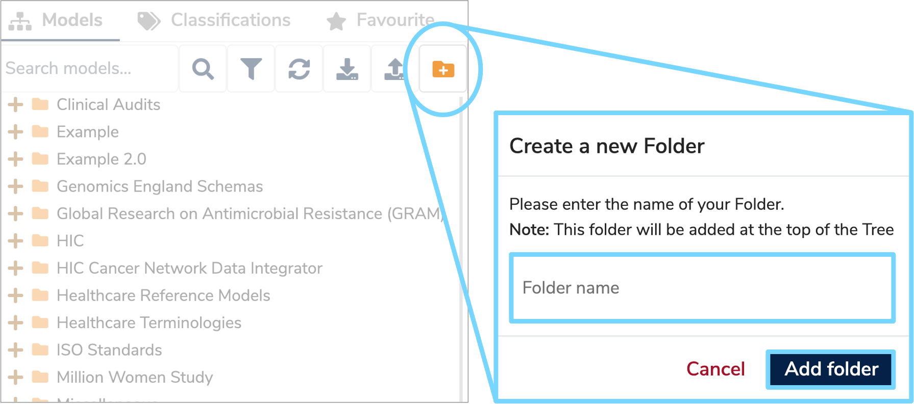
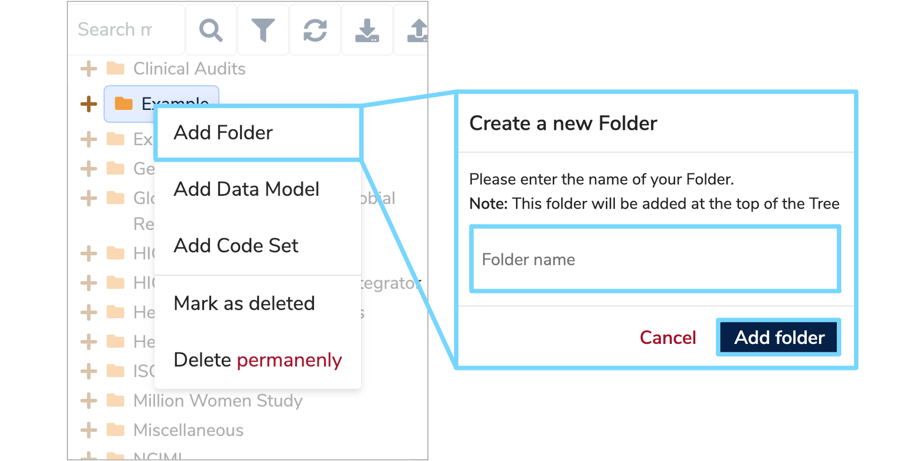
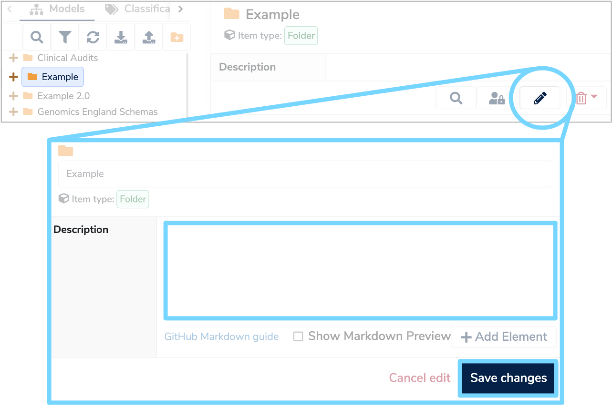

## **1. Create a new folder**
Data Models are stored in their own folders and subfolders which are displayed in the Model tree. Therefore, to create a new Data Model, first you need to either create a new folder, or add a subfolder.
To create a new folder click the **'Create a new Folder'** icon at the top right of the Finder Panel. Enter a Folder name and click **'Add folder'**. Your new folder should now appear in the Model tree. 

To create a new subfolder, right click on the existing folder you want and select **'Add Folder'**. Enter a folder name and click **'Add folder'**. Your new subfolder should appear within the relevant folder in the Model tree.

 

Whenever you create a folder you should also enter a short description detailing the purpose of the folder. To do this, select your new folder in the Model tree and click the **'Edit'** button. This will allow you to enter text into the description box. Once completed, click **'Save changes'** and the description will now display whenever the folder is selected.

## **2. Add Data Model**
To add a Data Model, right click your new folder or sub-folder and select **'Add Data Model'**. A **'New Data Model'** form should appear on the right. 

##  **3. Complete New Data Model form**

Please complete both the mandatory and optional fields on the New Data Model form, with the defintions of each field detailed below:

* **Label**  
	Enter the name you want to give your new Data Model which should uniquely identify it. Please include any asset version information, as two models cannot have the same label.
 
* **Author**  
	Use this field to record the name(s) of the authors who are creating and maintaining this Data Model.

* **Organisation**  
	This is the name of the organisation responsible for the Data Model, or the underlying data asset or standard.

* **Description**  
	Enter a detailed description of the data asset or standard and include  information on any important characteristics of the data.

* **Type**  
	Select whether this model is a **'Data Asset'** or a **'Data Standard'** from the dropdown menu. A **Data Asset** is a collection of pre-existing data such as a database or a number of completed forms. While a **Data Standard** is a template for data that is to be colleced such as a form or schema.

* **Classifier**  
	Enter the relevant classifier by either selecting from the existing list in the dropdown menu, or by typing a name to create a new classifier. You may enter multiple classifiers.

Once all the fields have been populated click **'Next Step'**. 

## **4. Select Default Data Type**

Now you need to select the relevant set of **'Default Data Types'** from the dropdown menu to be imported into your model. Select a category that you expect to have all its data types within your Data Model. However, if you are unsure at this stage, leave the field blank and you can import these later on. 

## **5. Submit Data Model**
Once completed, click **'Submit Data Model'** and your new Data Model will be added to your folder and will appear in the Finder Panel.

