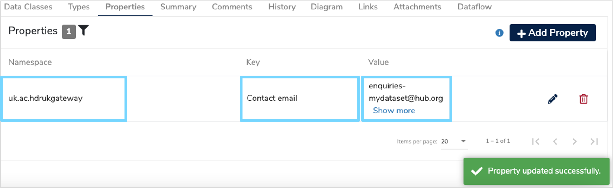

This user guide will explain the steps you need to follow to add a health dataset to the **[Mauro Data Mapper](https://modelcatalogue.cs.ox.ac.uk/mdm-ui/#/home)**.

---

## **1. Create a Data Model**
Datasets are stored in their own **[Data Models](../../../glossary/data-model/data-model.md)** within the Mauro Data Mapper. Therefore, you first need to create a new **[Data Model](../../../glossary/data-model/data-model.md)**. To do this follow the steps in our **[Create a Data Model user guide](../create-a-data-model/create-a-data-model.md)**.

Once you have reached step **[3. Complete New Data Model form](../create-a-data-model/create-a-data-model.md#complete-new-data-model-form)** you will need to select the **[Type](../create-a-data-model/create-a-data-model.md#complete-new-data-model-form-type)** as **'Data Asset'** from the dropdown menu.

Complete the rest of the steps until you have successfully submitted your **[Data Model](../../../glossary/data-model/data-model.md)**. 

---

## **2. Describe the dataset**
Once you've created your **[Data Model](../../../glossary/data-model/data-model.md)**, it's important to record further characteristics of the corresponding dataset, particularly to help gateway providers when designing interfaces. For example adding a contact email address.

To do this, select your **[Data Model](../../../glossary/data-model/data-model.md)** in the Model tree, then click the **'Properties'** tab on the panel below the model overview. Next, click **'+ Add Property'** and this will add a row in the property table, as shown in the video below.

<iframe src="https://player.vimeo.com/video/480691755" width="640" height="346" frameborder="0" allow="autoplay; fullscreen" allowfullscreen></iframe>

You will then need to complete the details of your new property as follows:

* **Namespace**  
	This will be used to select the correct properties by the gateway interface. Select **‘uk.ac.hdrukgateway'** from the dropdown menu.

* **Key**  
	Enter a property name such as 'contact email'.
	
* **Value**  
	This is the value of the given property, for example ‘enquiries-mydataset@hub.org’.

Once completed click the green tick **'Save'** and your new property should now be permanently displayed in the **'Properties'** tab. 

## **3. Describe data items**

Data items are created and managed within data classes.  If a dataset is managed as a collection of tables, then you may wish to create a class
 for each table.  This is the default approach.  Alternatively, you may wish to create a set of classes to provide a more abstract account of the
  data set - grouping and presenting the data items in a way that is quite different from the way in which they are stored and managed.
   
To create a new class, select a data model from the model tree, choose the ‘DataClasses’ tab, and click the ‘+’ button:

In documenting an existing data set, you will be creating rather than copying classes, so choose the first option and click ‘__Next__’.   You should
 then choose a name or label for your class. 
 
 
 
Again, you will be able to add further names later, as aliases, if you wish. The __description__ of a class may explain what kind of data items are
 grouped together here; alternatively, it may explain some common context for the items it contains, to avoid the need to include that information
  in the description of each individual item. 
  
The multiplicity values specify the number of instances of that class that may appear in an instance of the model.   For example, if a class were
 to correspond to a table in a relational database, the multiplicity values would be the minimum, and the maximum, number of rows allowed in the
  table.  In a model of a dataset, there is usually no need to specify the multiplicity of a class.
    
Once all mandatory fields have been completed, you may click ‘__Submit__’ to create the new data class.  This will take you to the page for the newly
-created class.  You can click the link back to the parent data model to continue adding further classes of data as necessary.

You may also choose to add further ‘child’ classes to this class: choose the 'Content’ tab on the DataClass page, and click the ‘+’ symbol to add
 a new data class.
 

Data items are represented as ‘data elements’ within the model.  To start adding data elements to a class, visit its DataClass page, and click the
 ‘+’ button on the ‘Content’ tab.  This will give you two options - to create a new contained ‘child’ class, as above, or to create a new data
  element - choose the second option.
  
As with creating a new class, this will give you the option to copy an existing data element from elsewhere in the model (or from another model
 which you have read access to).   In creating a model of an existing dataset, you will almost certainly want to create a new data element. 

The next form that appears will ask for the details of the new data element:

For __label__, enter the preferred name of the data item.  This could be the name of a column in a relational database, for example.  You can add
 further names as aliases later.
  
In __description__, you should describe the data item and the values it may take.  This may include information about provenance - the context of
 collection, and any subsequent processing, but should also say something about intended interpretation or possible use.  This description should
  explain the data point in terms that might be useful to prospective data users.
 
The __multiplicity__ of a data element specifies the number of values that it may take at the same time.   For example, the number of ‘date of death
’ items contained within a ‘patient’ record might be at least 0, and at most 1.  The __min__ field should be a positive whole number; the __max__
 field should be a positive whole number no smaller than min, or may be ‘__*__’ to indicate that no maximum number is set.  If you are unsure, this
  field may be left blank.
  
The __data type__ field describes the values that this data item may take.  A data type may be either:

- __primitive__: for example a String, an Integer, or a Date.  
- __enumerated__: chosen from a given list of values, which may be described using codes or free-text.  For example M = Male, F = Female, U
 = Unknown
- __reference-valued__: a reference to another class of data.  For example, the ‘Registered GP’ data element of a ‘Patient’ may refer to a separate
 class of ‘GP’ (containing name, surgery, address, etc)
 
When creating a new data element, you can choose to use an existing data type that belongs to the data model in question, or you can create a new
 data type (by providing its name, the list of values, or a class to reference, respectively).  From the data model page it is also possible to
  import data types from another model, or some pre-defined sets of data types (such as those found in MS SQLServer databases, for example).
   
Click ‘__Submit__’ to create the new Data Element.  Repeat this process to add the other data elements for each class.

## Entering this information offline

While creating a model of an existing dataset, you may find it more convenient to enter and share the information above using an Excel spreadsheet
 - and then upload the contents of that spreadsheet into the catalogue.   You can create more than one model using the same spreadsheet.
   
A blank spreadsheet should be included with this document, together with an example of a completed spreadsheet, describing the Diagnostic Imaging
 Dataset.   
 
The first sheet o the spreadsheet (which must be called DataModels) should introduce one or more data models.  Each subsequent sheet should
 describe the contents of one of these data models.
    
In the DataModels sheet, there should be one row for each data model described, and the following columns can be completed:
 
- __SHEET_KEY__: the name of the sheet (in this spreadsheet) describing the contents of the data model
- __Name__: the name or label of the data model (as explained above)
- __Description__: a brief description of the dataset 
- __Author__: the author of this data model of the dataset
- __Organisation__: the organisation holding the dataset 
- __Type__: this should be ‘Data Asset’
  
 In the blank spreadsheet supplied, there is a KEY_1 sheet with the column headings required for each of the subsequent sheets.   You can rename
  or copy this sheet.  Whatever name is chosen should be included in the list of data models presented in the opening ‘DataModels’ sheet (or the
   contents will not be uploaded).    The following columns should be completed:
    
- __DataClass Path__ (essential): this should be the path from the top level of the model to the data class described in the current row, or the
 class containing the item described in the current row; for a top-level class, it will be simply the class name; for child classes, it will be a
  list of class names, using “|” as a delimiter.
- __DataElement Name__ (essential for data elements): if the row is describing a data element, rather than a data class, then the name of the element
 should be inserted here 
- __Description__: an explanation of the intended interpretation (and perhaps also the context of collection or provenance) of the DataClass or
 DataElement
- __Minimum Multiplicity__ (may be left blank): the minimum number of instances of the class or element, usually 0 or 1 
- __Maximum Multiplicity__ (may be left blank): the maximum number of instances, with -1 (rather than *) used to indicate that there is no upper
 bound 
- __DataType Name__ (essential for data elements): the name of the data type of the data element being described
- __DataType Description__ (needed only for the first time that the data type in question is mentioned): the description of the data type 	
- __Reference to DataClass Path__: if the data type is another class (if the data element is a reference to an instance of another class) then
 insert the path to that class here
- __Enumeration Key__ and __Enumeration Value__: if the data type is an enumeration, then you may add several pairs of entries in these two columns, 
one for each key-value pair in the enumeration; in each case, the key is the text or string that may appear in a column of the dataset, and the
value is its expansion or explanatory text.   Once you have done this, you will need to select the corresponding cells in the DataClass Path
column - the first column - and merge them.   You may wish to merge the corresponding cells in the other columns as well, for a clearer
presentation of the information: for example, 

  

A completed spreadsheet can be imported into the catalogue using the ‘import’ button, located on the toolbar at the top of the screen:

Select the Excel importer. 

Having chosen to import from a spreadsheet, you will have the opportunity to provide some more information:

- __Folder__: this is the folder in which the newly created model(s) will reside.  The drop-down menu lets you choose a folder which you have
 access to
- __Finalised__: we recommend that you keep models as ‘draft’ until the gateway presentation of model descriptions has been decided
- __Import__: as new documentation version	check this option if you intend to replace the current (catalogue) version of an existing model
 description
- __File__: Choose the spreadsheet file for upload.  You may drag/drop a file from your file browser into the box here.

Press ‘__Submit__’ to import the model.

Excel files can be safely used to "round-trip" data model descriptions.  You can export a model from the catalogue in spreadsheet form, edit the
spreadsheet, and import the new version of the spreadsheet to produce an updated version of the model - in this case, you need to select “New
Documentation Version”.

## Extracting metadata from a relational database

If the dataset to be described is held in a relational database, and you have direct access to that database, you can also use the catalogue to
extract basic metadata - table names, column names, types, and structural relationships - from the database itself.   The effort of manual data
entry can then be focussed upon producing adequate accounts of the account of the intended interpretation of each data element.   Clicking on the
‘import’ button as above, you can select an importer for most types of relational database.
   

Having chosen to import from a relational database, the next set of options allow you to configure the import.  Fields marked with a ‘*’ are
 mandatory.  The fields should be completed as follows: 
 
- __Folder__: this is the folder in which the newly created model(s) will reside.  The drop-down menu lets you choose a folder which you have
 access to
- __Data Model Name__: this will be the name of the new data model.  If no name is specified, the name of the database will be used.
- __Finalised__: if the newly-imported model is immediately ‘finalised’, you will no-longer be able to make changes to it.  We recommend that
 you keep models as ‘draft’; otherwise if you wish to edit the descriptions you will need to create a new version.
- __Import as new documentation version__: this determines how the newly imported model supersedes any existing model with the same name.  We
 recommend you check this option if you intend to overwrite an older version of the model.
- __Database Name(s)__: please enter the database name.  If you’d like to import multiple databases in one go, please enter the list of names
, separated by a comma.
- __Database Host__: this is the IP address, or the server name, of the machine that the database is installed on.
- __Username__: this is the username which is used to connect to the database.  Ideally, a user with read-only access will be used.  This is not
 stored within the Metadata Catalogue application.
- __Password__: the password used by the user to connect to the database.  This is not stored within the Metadata Catalogue application.
- __Database port__: the port which the database is communicating on - eg. 1433 for MS SQL Server.  If no port is specified, the default
 port for the database will be used (MS SQL Server: 1433, Postgres: 5432, OracleDB: 1521)
- __SSL__: whether the database requires an encrypted connection (usually false).

## Other features

The catalogue toolkit has a range of related functions for creating and updating models of datasets and data standards.   As the features of the 
gateway interface are determined, we will update this documentation to address any additional metadata requirements, and to describe any 
additional functions that have become relevant.   We will update it also to describe any improvements made to the functions described above.   

This document explains how to create a standard description for a health dataset using the metadata catalogue.   Such a description will come in
 two parts:

1.	a description of the dataset as a whole
2.	descriptions of the individual data items within the dataset, and of the structural relationships between them 

There is no single, applicable standard for the first part.  For the moment, pending the development of the gateway interface, we require only a
 minimal set of properties, sufficient to uniquely identify the dataset in question.  A slightly longer list will be required once the gateway
  specification has been agreed. 

For the second part, we are able to adapt and extend an existing international standard for metadata registration: ISO/IEC 11179.  We specify a
 list of properties that should be recorded for each item, and each relationship; this list will remain unchanged, although the information
  provided may be updated over time. 

If the dataset is held in a relational datastore, then we may be able to determine the name and type of each data item, and the structural
 relationships between them, automatically.  We will not, however, be able to determine an __adequate, human-readable explanation__ of each item
 ; this will need to be entered by hand and/or carefully extracted from existing, electronic documentation.  