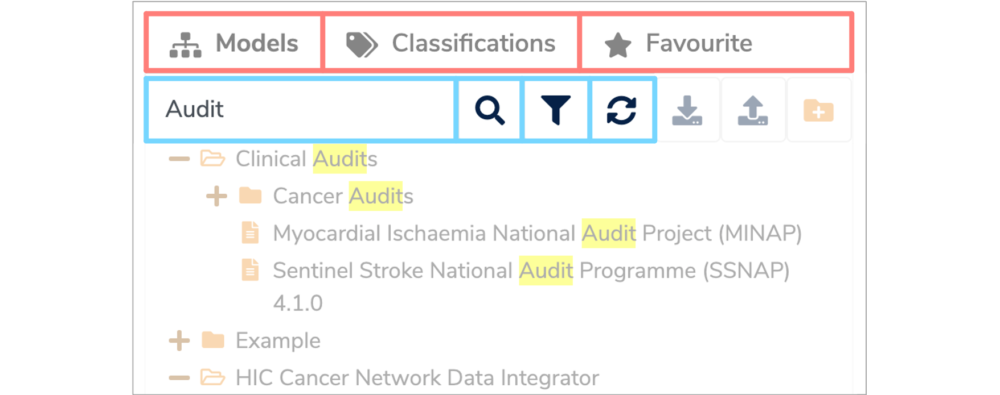
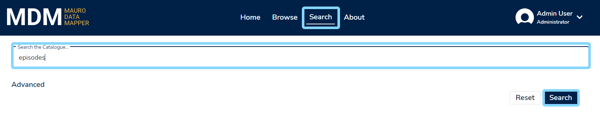
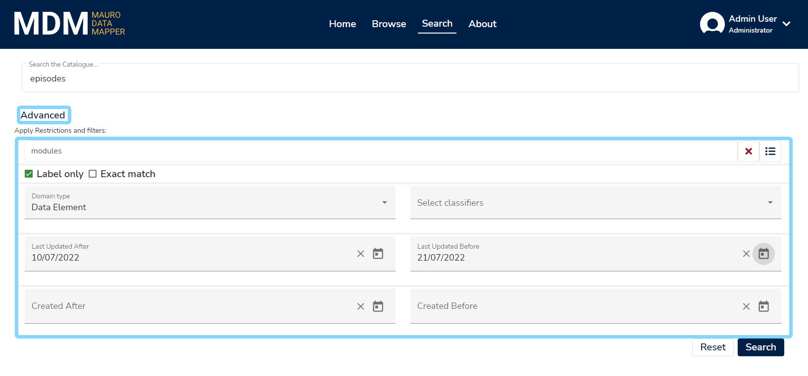
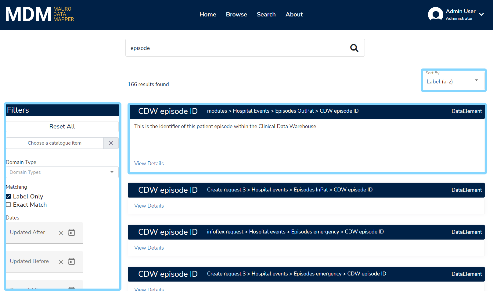
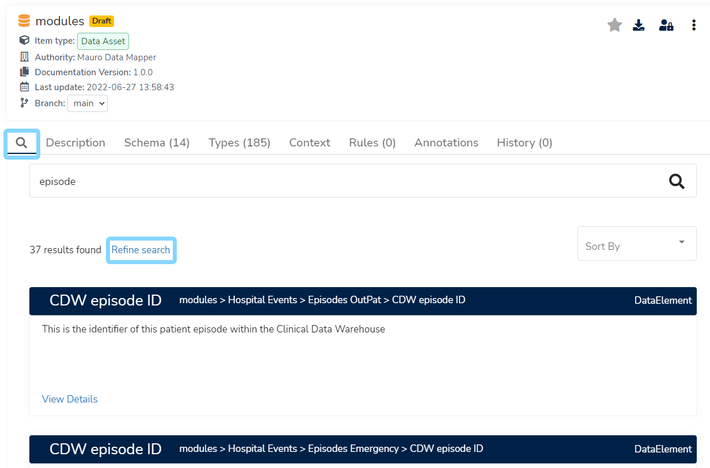

The search function within **Mauro Data Mapper** is extremely powerful and allows you to search for datasets or specifications throughout the whole catalogue. This user guide will explain how to effectively search for an item as well as the methods **Mauro Data Mapper** uses for searching. 

---

## 1. Types of search

There are several different ways to search for an item within **Mauro Data Mapper**. 

### 1.1 Search model tree

The first method of searching is to use the search box on the top left of the finder panel above the **Model Tree**. Here, you can search **'Models'**, **'Classifications'** and **'Favourites'** by clicking the relevant tab and then entering the search term in the search box. 

As you type your search, the **Model Tree** will automatically filter, displaying only the relevant results, with the search term highlighted in yellow wherever it appears within the list. 

When searching **Models**, the results list will show [Data Models](../../glossary/data-model/data-model.md) and [Data Classes](../../glossary/data-class/data-class.md) which match the search term in any [Label](../../glossary/label/label.md), description, comment or property.

To refresh the results, click the **'Search'** icon or the **'Reload Data Models Tree'** icon in the menu to the right of the search box. You can also choose whether you want the results list to feature superseded or old **Data Models** by clicking the **'Filters'** icon and then selecting the relevant options. To remove filtering click the small **'x'** on the right of the search box. 

### 1.2 Search catalogue

Another method of searching is to use the main search box for the entire catalogue, which can be found under the **'Search'** tab in the header. Simply enter your search term(s) and click the **'Search'** button to start searching.

To use more advanced search options, click on the **'Advanced'** button to expand the advanced search controls. These will allow you use more refined filters, such as:

1. A _context_ to restrict to - such as a top level data model.
2. Which _domain types_ to search for.
3. _Date ranges_ to restrict to.

And so on.

The list of search results will then provide details on all the catalogue items found that match your search criteria. You can interactively adjust the filters along the left side of the screen, as well as control sorting. Click on any **'View details'** link to be taken directly to that catalogue item.

### 1.3 Search within a model

Finally, you can also search within **Data Models** directly, as well as **Folders** and **Versioned Folders**. This is equivalent to performing a catalogue-wide search (as described above) but automatically restricted by a model context. When viewing a **Data Model**, click on the **magnifier** tab icon to view the search area, then enter your search term(s). Search results are then listed and automatically constrained to both the parent model and relevant domain types for that model.

Clicking on the **'Refine search'** link will take you to the main catalogue search results page, allowing you to control the filtering manually.

---

## 2. How search works

The search functionality in **Mauro Data Mapper** implements the **Simple Query Strings** of [Hibernate search](https://docs.jboss.org/hibernate/stable/search/reference/en-US/html_single/#_simple_query_string_queries%7CSimple). 

This is essentially where a simple syntax is used to parse and split the provided query string into terms based on special operators. The query then analyses each term independently before returning matching results. 

### 2.1 Search syntax

The search syntaxes that **Mauro Data Mapper** supports are:

* **AND** using **+**
* **OR** using **|**
* **NOT** using **–**
* To search for different suffixes use * e.g. prefix* 
* To search for an exact phrase use **""** e.g. "example phrase"
* To add precedence to search terms, use **()** e.g. (important) example
* To search for similar terms (fuzzy string searching) use **~2** e.g. smoke~2 will return smokes, smake etc
* To search for similar phrases use **""** and **~2** e.g. "cigarette smoke"~3

For example, if you are interested in information relating to smoking. Searching **‘smoking’** will return a list of results. However, if you want to be more generic you can type __‘smoke*’__ which will search for smoking, smoker, smoked etc. 

To look at information relating to smoking and pregnancy you can type __'smok*+pregnancy'__ which will return results that include both pregnancy and the different variants of smoking.  

### 2.2 Search examples

Below are some more examples to further illustrate how to use the search syntaxes effectively:

* **storm~2** - will return results containing storms or sturm
* **war + (peace | harmony)** - will return results containing "war and either peace or harmony"
* **storm tree** - will return results containing the words storm or tree
* **storm and tree** - will return results containing exactly the phrase storm and tree

### 2.3 Label & Metadata Key

The **Label** and **Key** entries are indexed using a **WordDelimiter analyser**. This essentially splits up the search term into individual words at the following points:

* Spaces 
* Hypens
* Numbers
* Capital letters
* Full stops

These individual words are referred to as **'Keys'** and once the search term has been split up into its various keys, these are then saved and used to conduct the search. Therefore, the results will only match the keys and not the whole search phrase.

For example:

* **Datamodel for test** - will be searchable by the keys **datamodel**, **for** and **test**
* **Test DataModel** - will be searchable by the keys **test**, **data** and **model**, it will not be searchable by the key **datamodel** because of the capital letter
* **Test DataModel V1.0.1** - will be searchable by the keys **test**, **data**, **model**, **v1**, **0** and **1**. It will not be searchable by the keys **datamodel** or **v1.0.1**
* **subject-34567** - will be searchable by the keys **subject** and **34567**

---