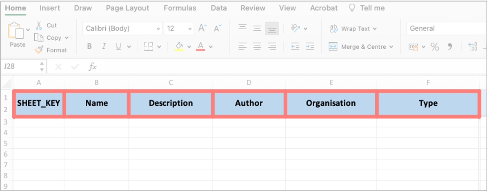
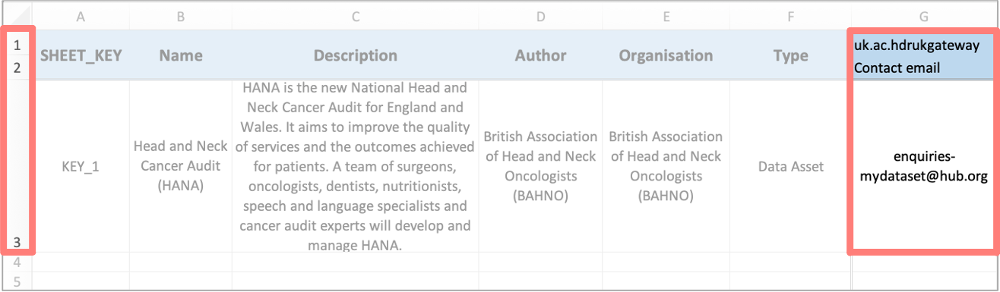
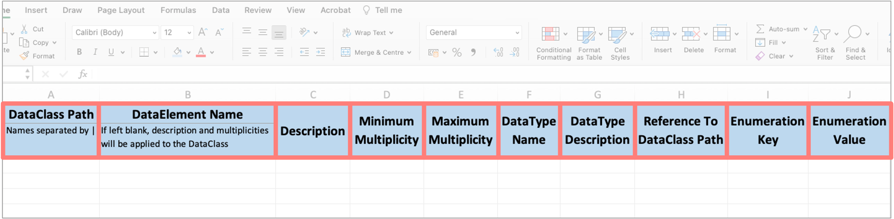
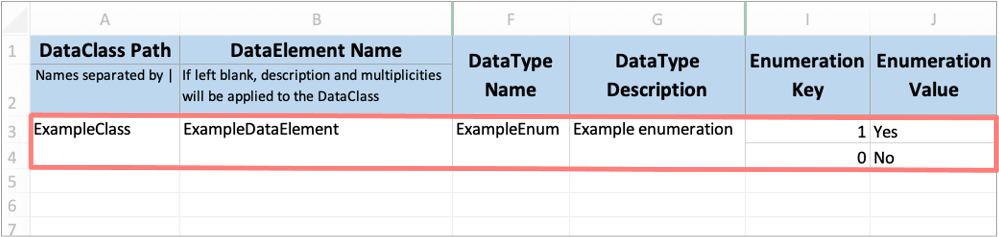
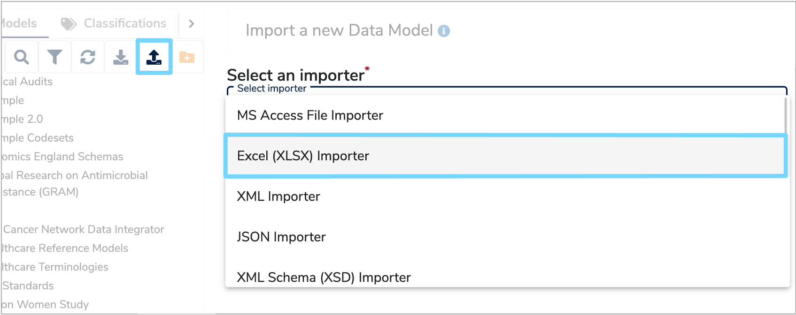
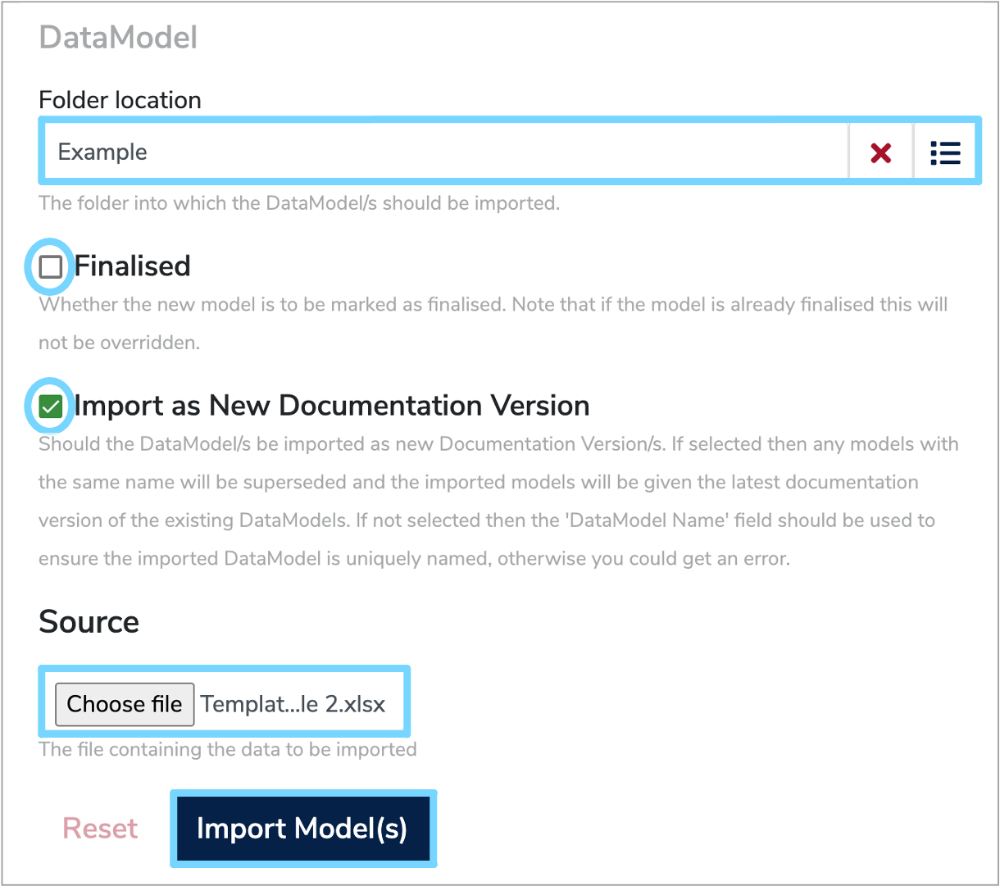

This user guide will explain the steps you need to follow to import a health dataset to the [Mauro Data Mapper](https://modelcatalogue.cs.ox.ac.uk/mdm-ui/#/home) using an Excel spreadsheet.

---

To add an existing dataset to [Mauro Data Mapper](https://modelcatalogue.cs.ox.ac.uk/mdm-ui/#/home), you can either enter all the information online as explained in the ['Document a Health Dataset user guide'](../document-a-health-dataset/document-a-health-dataset.md), or you may find it more convenient to import information automatically from an Excel spreadsheet. 

The importing functionality of [Mauro Data Mapper](https://modelcatalogue.cs.ox.ac.uk/mdm-ui/#/home) allows you to import several [Data Models](../../glossary/data-model/data-model.md) using the same spreadsheet. 

---

## **1. Create [Data Model](../../glossary/data-model/data-model.md) import file**

To ensure all the information is imported correctly, the dataset needs to be entered into a spreadsheet in a specific format. To help with this, you can download a zip file of the [standard template here](Template_DataModel_Import_File.xlsx.zip).

This **‘Data Model import file’** standard spreadsheet contains two types of worksheets. Firstly, there is the [Data Model listing sheet](../import-data-model-from-excel/import-data-model-from-excel.md#listing-sheet), titled **‘DataModels’**. This is effectively a contents page which lists the main details of each [Data Model](../../glossary/data-model/data-model.md) you wish to import. There must only ever be one [Data Model listing sheet](../import-data-model-from-excel/import-data-model-from-excel.md#listing-sheet).

The next sheet is the [Data Model key sheet](../import-data-model-from-excel/import-data-model-from-excel.md#key-sheet) which is titled **‘KEY_1’**. This contains all the relevant details of one [Data Model](../../glossary/data-model/data-model.md) listed in the **‘DataModels’** sheet. Therefore, if you wish to import several [Data Models](../../glossary/data-model/data-model.md), you will need to add a [Data Model key sheet](../import-data-model-from-excel/import-data-model-from-excel.md#key-sheet) for each additional [Data Model](../../glossary/data-model/data-model.md) and title it **‘KEY_2’**, **‘KEY_3’** respectively.

###  **1.1 Data Model listing sheet**

In the **Data Model listing sheet**, use one row for each [Data Model](../../glossary/data-model/data-model.md). Enter the information according to the columns, which are explained below, along with any other properties or metadata which may be relevant. 

The following columns must be completed:

* **SHEET_KEY**  
	The unique name of each [Data Model key sheet](../import-data-model-from-excel/import-data-model-from-excel.md#key-sheet) such as **‘KEY_1’**, **‘KEY_2’** etc. 

* **Name**  
	The unique name or [Label](../../glossary/label/label.md) of the [Data Model](../../glossary/data-model/data-model.md). Remember this should be different to all the existing [Data Models](../../glossary/data-model/data-model.md) within [Mauro Data Mapper](https://modelcatalogue.cs.ox.ac.uk/mdm-ui/#/home), unless you are updating an existing [Data Model](../../glossary/data-model/data-model.md)
	
* **Description**  
	Enter a description which explains the contextual details of the dataset within the [Data Model](../../glossary/data-model/data-model.md). 
	
* **Author**  
	Record the name(s) of the authors who are creating and maintaining this [Data Model](../../glossary/data-model/data-model.md).
	
* **Organisation**  
	Type the name of the organisation responsible for the [Data Model](../../glossary/data-model/data-model.md), or the underlying data.
	
* **Type**  
	This is the type of the [Data Model](../../glossary/data-model/data-model.md), which can either be a [Data Asset](../../glossary/data-asset/data-asset.md) or a [Data Standard](../../glossary/data-standard/data-standard.md). A [Data Asset](../../glossary/data-asset/data-asset.md) is a collection of existing data, such as a database or a completed form. While a [Data Standard](../../glossary/data-standard/data-standard.md) is a specification template to collect new data, such as a form or schema.
	
* **Adding properties**  
	Any other relevant properties or metadata relating to the [Data Model](../../glossary/data-model/data-model.md) can be included in additional columns to the right of the core columns. Metadata can have the following properties:
		
	* **Namespace**  
		This will be used to select the correct properties by the gateway interface such as **'uk.ac.hdrukgateway'** and should be entered in **row 1** of the spreadsheet. If it is left blank, the default namespace of **ox.softeng.metadatacatalogue.plugins.excel** will be used. 
		
	* **Key**  
		This is a relevant property name such as **‘contact email’** and ***must*** be entered in **row 2**. If no key is supplied, then the value will not be assigned.
	
	* **Value**  
		This is the **Value** of the given property, for example **‘enquiries-mydataset@hub.org’** and should be entered into the relevant row. If multiple rows are being imported and a **Namespace** and **Key** column is created, then the property will only be assigned if a **Value** is supplied. 
	
	

	
	
###  **1.2 Data Model key sheet**

There should be one **Data Model key sheet** for each [Data Model](../../glossary/data-model/data-model.md), and its name should correspond to the relevant **'SHEET_KEY'** on the [Data Model listing sheet](../import-data-model-from-excel/import-data-model-from-excel.md#listing-sheet). Any [Data Model](../../glossary/data-model/data-model.md) listed without the correctly named key sheet will not be imported. 

Therefore, the best practise is to first copy the **'KEY_1'** sheet in the standard excel template, rename it and then add the details of the relevant [Data Model](../../glossary/data-model/data-model.md). Otherwise, formatting issues could occur, resulting in the data importing incorrectly.  

The following columns must be completed:

* **DataClass Path**  
	This is the path from the top level of the [Data Model](../../glossary/data-model/data-model.md), to the [Data Class](../../glossary/data-class/data-class.md) entered in this row. For a top level [Data Class](../../glossary/data-class/data-class.md), only the class name should be entered in this field. However, if it is a **Nested Data Class**, then the name of the parent class along with the child class should be entered and be separated by **“I”**, for example: 
	* A nested class: **'parentIchild'**
	* A nested class within a nested class: **'grandparentIparentIchild'**
	* Another nested class within a nested class: **'grandparentIparentIanotherChild'**

* **DataElement Name**  
	If the row is describing a [Data Element](../../glossary/data-element/data-element.md), instead of a [Data Class](../../glossary/data-class/data-class.md), then the name of the [Data Element](../../glossary/data-element/data-element.md) should be entered here. 

	If supplied, the remaining information in this row will be used to create the [Data Element](../../glossary/data-element/data-element.md) inside the [Data Class](../../glossary/data-class/data-class.md) provided in the **'DataClass Path'** column. However, if left blank, the remaining information in this row will be assigned to the [Data Class](../../glossary/data-class/data-class.md) entered in the **'DataClass Path'** column. 

* **Description**  
	Enter a description which explains any contextual details relating to the [Data Element](../../glossary/data-element/data-element.md) or [Data Class](../../glossary/data-class/data-class.md).

* **Minimum Multiplicity**  
	The minimum number of instances of the [Data Class](../../glossary/data-class/data-class.md) or [Data Element](../../glossary/data-element/data-element.md) within the [Data Model](../../glossary/data-model/data-model.md). 
	Optional data has a minimum **Multiplicity** of 0, whereas mandatory data has a minimum **Multiplicity** of 1.
	
* **Maximum Multiplicity**  
	The maximum number of instances of the [Data Class](../../glossary/data-class/data-class.md) or [Data Element](../../glossary/data-element/data-element.md) within the [Data Model](../../glossary/data-model/data-model.md). 
	Optional data has a maximum **Multiplicity** of 1, whereas data which occurs any number of times and therefore has no upper bound has a maximum **Multiplicity** of ‘*’ which represents ‘-1’ internally.
	
* **DataType Name**  
	This is the name given to the **Data Type** of the [Data Element](../../glossary/data-element/data-element.md) being described and must be included when entering information for [Data Elements](../../glossary/data-element/data-element.md). 
	
	The **Data Type** describes the range of possible values that the [Data Element](../../glossary/data-element/data-element.md) may take. There are four different **Data Types** stored within a [Data Model](../../glossary/data-model/data-model.md):
	
	* **Enumeration**  
	A constrained set of possible values. Each **Enumeration** type defines a number of **Enumeration Values** which have a coded key and a human-readable value.
	
	* **Primitive**  
	A string, date or integer.

	* **Reference**  
	Data with detailed properties which is used to describe relationships between different [Data Classes](../../glossary/data-class/data-class.md) within the same [Data Model](../../glossary/data-model/data-model.md).
	
	* **Terminology**  
	A structured collection of **Enumerated Values** which has relationships between different data terms.

* **DataType Description**  
	This is a short description of the **Data Type**. If the same **Data Type** is used multiple times, then the first description entry will be used so subsequent description fields can be left blank.

* **Reference to DataClass Path**  
	If the [Data Element](../../glossary/data-element/data-element.md) is a **‘Reference’** **Data Type** and therefore the [Data Element](../../glossary/data-element/data-element.md) is a reference to an instance of another [Data Class](../../glossary/data-class/data-class.md), then the path to that [Data Class](../../glossary/data-class/data-class.md) should be entered here. 
	
	This path must match a path provided in the **'DataClass Path'** column using the same format with **‘I’** as the separator. This field cannot be used in conjunction with **‘Enumeration Key’** and **‘Enumeration Value’**. 

* **Enumeration Key**  
	If the [Data Element](../../glossary/data-element/data-element.md) is a **‘Enumeration’** **Data Type**, then the **Key** and **Value** of each Enumeration type should be included in the **‘Enumeration Key’** and **‘Enumeration Value’** columns respectively, with one **Key** and **Value** per row. 
	
	The **Enumeration Key** is the text or string that may appear in a column of the dataset. 

* **Enumeration Value**  
	The **Enumeration Value** is the data that corresponds to the key. For example, for a yes/no question on a webform, the **Value** is either ‘Yes’ or ‘No’. Each **Value** is assigned a **Key**, which in this case could be ‘1’ and ‘0’ respectively. 
	
	An **Enumeration Value** must be provided if an **Enumeration Key** has been entered. 
	
	Once all the **Enumeration Key** and **Value** pairs have been entered you will need to merge the corresponding cells in the **'DataClass Path'** column, and you may wish to merge the other relevant cells in the other columns too for consistency.

For example, if you were entering the information for a [Data Element](../../glossary/data-element/data-element.md) that was an **Enumeration Data Type** then the [Data Model key sheet](../import-data-model-from-excel/import-data-model-from-excel.md#key-sheet) would look similar to the below: 

	
 ---

## **2. Import [Data Model](../../glossary/data-model/data-model.md)**

Once the **Data Model import file** has been completed, click the **'Import a Data Model'** icon at the top right of the **Model Tree**. The **'Import a new Data Model'** form will then appear on the right. 

Click the **'Select an importer'** box and select **'Excel (XLSX) importer'**
from the dropdown menu. This will automatically load the rest of the form that you need to complete. 

You then need to select the relevant folder that you wish to import the [Data Model](../../glossary/data-model/data-model.md) into. You can do this by either typing in the folder name, or clicking the menu icon to the right of the **'Folder location'** box. This will display the **Model Tree**, from which you can then select the relevant folder.  

You then need to tick the **'Finalised'** box to indicate whether the [Data Model](../../glossary/data-model/data-model.md) you are importing is finalised. Although, it is recommended to keep the model as a draft until the gateway presentation of model descriptions has been decided. 

If the [Data Model](../../glossary/data-model/data-model.md) you are importing is intended to replace an existing [Data Model](../../glossary/data-model/data-model.md) within the current version of [Mauro Data Mapper](https://modelcatalogue.cs.ox.ac.uk/mdm-ui/#/home), then tick the **'Import as New Documentation Version'** box. This means that the imported model will supersede any [Data Models](../../glossary/data-model/data-model.md) with the same name and will be assigned the latest documentation version of the existing [Data Model](../../glossary/data-model/data-model.md). 

If you are importing a new [Data Model](../../glossary/data-model/data-model.md), then make sure the **'Name'** field in the [Data Model listing sheet](../import-data-model-from-excel/import-data-model-from-excel.md#listing-sheet) is unique, otherwise this will cause an error when importing. 

In the **'Source'** box, click **'Choose file'** and your file explorer will open. Navigate to the relevant **Data Model import file** and then select **'Import Model(s)'**. 

---

## **3. Round Tripping [Data Models](../../glossary/data-model/data-model.md)**

Excel files can be safely used to 'Round trip' [Data Model](../../glossary/data-model/data-model.md) descriptions. This is essentially where:

* A [Data Model](../../glossary/data-model/data-model.md) is exported in the form of an Excel spreadsheet.
* This exported spreadsheet is edited or updated with new information.
* The new version of the spreadsheet is re-imported into [Mauro Data Mapper](https://modelcatalogue.cs.ox.ac.uk/mdm-ui/#/home) and therefore automatically updates the existing [Data Model](../../glossary/data-model/data-model.md). 
	
	Note: **'Import as New Documentation Version'** should be ticked when re-importing. 

This method is a quick and easy way to update existing [Data Models](../../glossary/data-model/data-model.md) as well as adding extra information. This can be particularly useful when [Data Models](../../glossary/data-model/data-model.md) have previously been imported using an alternative method, and therefore may only have the basic layout. 

---