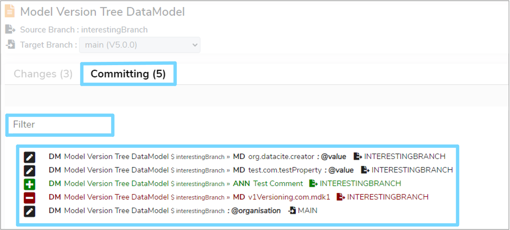

This user guide explains how to merge [Data Models](../../glossary/data-model/data-model.md) including comparing and committing changes as well as how to successfully resolve conflicts.

---

## 1. Overview

When working with multiple [branches](../../glossary/branch/branch.md) on the same model, it is likely that these multiple branch versions will have modifications such as additions, deletions and edits. Eventually, it will be necessary to **merge** all these back into one single draft version of the model. This is why every model has a **main** branch which acts as a single branching point and is also where models are [finalised](../../glossary/finalise/finalise.md) from.

**Merging** models is quite a complex task, as it is important not to lose any potential changes during the merge process. This is why a special user interface has been designed for you to:

* Review all changes that have occurred.
* Assist in resolving **conflicts**, which are any changes that have occurred in two models that do not automatically align.
* Commit the changes you wish to make to a model.

**Merging** can be applied to **Data Models** or **Versioned Folders** and includes merging changes within the model hierarchy as well. For example, changes made to [Data Classes](../../glossary/data-class/data-class.md) also count as modifications to a **Data Model**, and so on.

---

## 2. Terminology

As **merging** is an advanced user concept, the following terms will be used throughout this user guide:

* **Source**  
	The model or folder where changes are coming **from**. For example, the source would typically be a branch that is not the **main** branch.

* **Target**  
	The model or folder where changes are going **to**. This is usually the **main** branch, but is not always the case.
	
* **Change**  
	Any field that has changed between **Source** and **Target**. These will be:
	
    * **Addition** - something has been added to **Source** which will then be added to **Target**
    * **Deletion** - something has been removed from **Source**, or has been added to **Target**
    * **Modification** - something exists in both **Source** and **Target**, but has different values

* **Conflicts**  
	When a **modification** exists which cannot automatically be resolved. This typically happens when a piece of text has been changed and the same sentence has been modified. A user must manually resolve such conflicts to avoid losing important information or context

* **Paths**  
	A **fully qualified path** is the full name of a model field (or a field within the model hierarchy). Paths are used as full unique identifiers to list all the changes within a model or folder

* **Commit**  
	Saving all changes gathered together, from both **Source** and **Target**, and updating the end **Target** model or folder

---

## 2. Visualise branches

It can be difficult to keep track of all branches in the **Model Tree**, especially if there are multiple branches. Therefore, Mauro allows you to visualise the branches as well as previous versions or forks in a **merge graph**.

To find out how to access this **merge graph** see section ['4. Merge graph'](../branch-version-fork/branch-version-fork.md#merge-graph) of our ['Branching, versioning and forking Data Models' user guide](../branch-version-fork/branch-version-fork.md).

---

## 3. How to merge

Firstly, select the relevant draft **Data Model** or **Versioned Folder** that has more than one branch in the **Model Tree**. Once the item's details panel is displayed on the right, click the three vertical dot menu at the top right of the details panel. Select **'Merge...'** from the dropdown menu and this will navigate you to the merge interface. 

---

## 4. The merge interface

The interface for merging is split into several parts:

### 4.1 Merge controls

The top of the interface lists:

* The label of the catalogue item that is being merged
* The **Source** branch to get changes from
* The **Target** branch to merge changes into. You are able to select from any available branch, typically **main** is initially selected

	> Note: This is disabled if there are any changes being **committed**, which locks the target. To change the target branch again, cancel all changes being committed, start again and re-calculate the differences
	
* The **Commit Changes** button. Clicking this will finish the merge operation (see below)
* The **Cancel** button. Click this to cancel the merge operation and return to the catalogue without saving any changes

### 4.2 Changes list

The **'Changes'** tab lists all the changes made between the chosen **Source** and **Target**. All changes use **path names** to fully explain where they are in relation to the model hierarchy (see below for more details).

The changes list displays all the changes that have been made, but each change must be moved to the **'Committing'** list in order to actually save the change to the **Target**. See section ['4.5 Comparison view'](../merging-data-models/merging-data-models.md#comparison-view) below.

The changes list also allows you to:

* Filter the list by typing in a name
* Use all changes taken from the **Source** branch
* Use all changes taken from the **Target** branch

### 4.3 Committing list

The **'Committing'** tab lists all the changes that are going to be committed to the **Target** branch when saved. This is similar to the **'Changes'** list, but also displays where the committed changes have come from. For example, from **Source**, **Target**, or a mixture of both.

> Note: After an initial comparison, the **'Committing'** list may include some changes automatically. This is because Mauro has determined that these changes have no conflicts and so can be included by default, however you can undo these changes manually.

### 4.4 Path names

Fully qualified paths are used to describe the field changes that have occurred in a model hierarchy. You can hover the mouse over each section of the path name to find out what they mean, but in summary:

* The first few capital letters represent the **domain type**. For example **'DM'** is for **'Data Model'**, **'DC'** is for **'Data Class'**, **'MD'** is for **'Metadata'** etc
* This prefix is followed by the label of that item
* Anything after a **'$'** represents the branch name the item is for
* Anything after a **'@'** represents the name of the field that has changed
* These then repeat if hierarchical, split by a **'»'** separator

###  4.5 Comparison view

You can click on any item from the **'Changes'** or **'Committing'** lists to display a comparison view below. There are three types of comparison views that can be shown and this will depend on the change you have selected. 

If you have selected an addition change, as highlighted by a green **'+'** symbol, then the comparison view will display what will be **added** to the **Target** in its entirety.

If you have selected a deletion change, as highlighted by a red **'-'** symbol, then the comparison view will display what will be **removed** from the **Target** in its entirety.

If you have selected an edit change, as highlighted by a dark blue pencil symbol, then the comparison view will display the values in both **Source** and **Target**, highlighting the differences between the two.

Using the comparison view you must then choose how this change should be committed. If the only option that appears at the top of the comparison view is an **'Accept'** button, then clicking this will move the change to the **Committing** list. 

However, if there are changes to consider, then a range of options will appear at the top of the comparison view:

* **'Use "Source"'**  
	Commit the value that is in the **Source** branch, ignoring the **Target** copy

* **'Use "Target"'**  
	Commit the value that is in the **Target** branch, ignoring the **Source** copy
   
* **'Open Editor'**  
	Open an editor window to manually correct the value to commit to **Target**. See section ['5. Resolving conflicts'](../merging-data-models/merging-data-models.md#resolving-conflicts) below
   
* **'Link Scrolls'**  
	This will synchronise the scroll bars of the two values to better visualise the changes between them. To switch this off, click this button again
	
---

## 5. Resolving conflicts

Sometimes Mauro is unable to determine exactly which change from which branch is required. Or there may be cases where you want some changes from **Source** and **Target** included together. To make these decisions, click on the **'Open Editor'** button in the top right of the comparison view, this will bring up the **Conflict Editor**.

The **Conflict Editor** will display:

* The full path to the field being reviewed
* The entire value from the **Source** branch, with differences highlighted (left)
* The entire value from the **Target** branch, with differences highlighted (right)
* The **'Resolved'** value (initially the value from **Source**) which can be manually edited and is located at the bottom of the **Conflict Editor**. 

You can click the differences highlighted in green in the **Source** and **Target** views to automatically add them to the **Resolved** editor, replacing any red highlighted **'---'** sections.

Alternatively, you can manually remove all the red **'---'** sections from the **Resolved** editor and adjust any text as you wish. Use the **Source** and **Target** views as a guide for how your content should look.

Once you are happy with how the resolved text looks, click on the **'Resolve Conflict'** button. The text entered in the **Resolved** editor will now be the committed value for the **Target** branch. In the **'Committed'** list, the field will be tagged with the **'Mixed'** suffix to show that the change was manually modified.

---

## 6. Commit your changes

When you are happy with your **'Committing'** list, you can save and commit all changes to the **Target** branch.

> Note: Not every listed change has to be pushed to the **'Committing'** list, but there must be at least one change to commit. This allows you to perform partial merges, for example to keep track of **work in progress**.

Click on **'Commit Changes'** which will display a **'Check in Branch'** dialogue box. Here you will find a list of all the changes you are committing for a final review. You can enter an optional comment in the **'Commit Comment'** box for this merge change. This will be tracked in the history of the **Target** catalogue item.

You can also select the option to **'Delete Source Branch'** once the merge has finished. This can be useful to tidy up remaining branches which are no longer needed once merged back into **main**.

Once you have checked everything, click on the **'Commit'** button to save all the selected changes to the **Target** catalogue item.

---