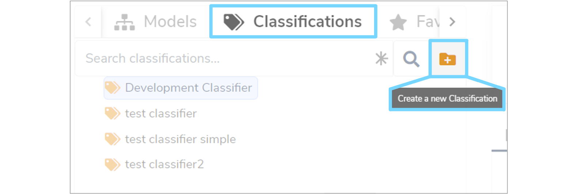
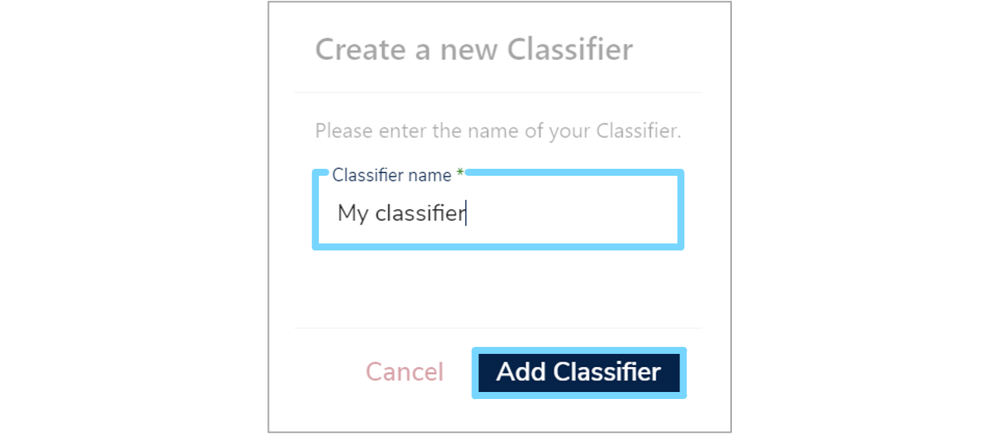
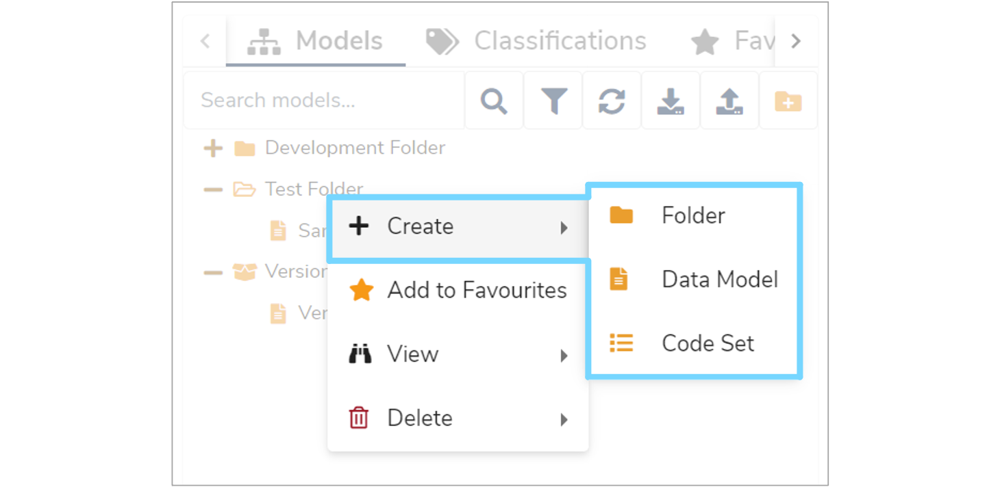
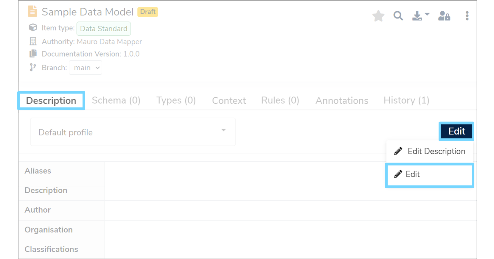
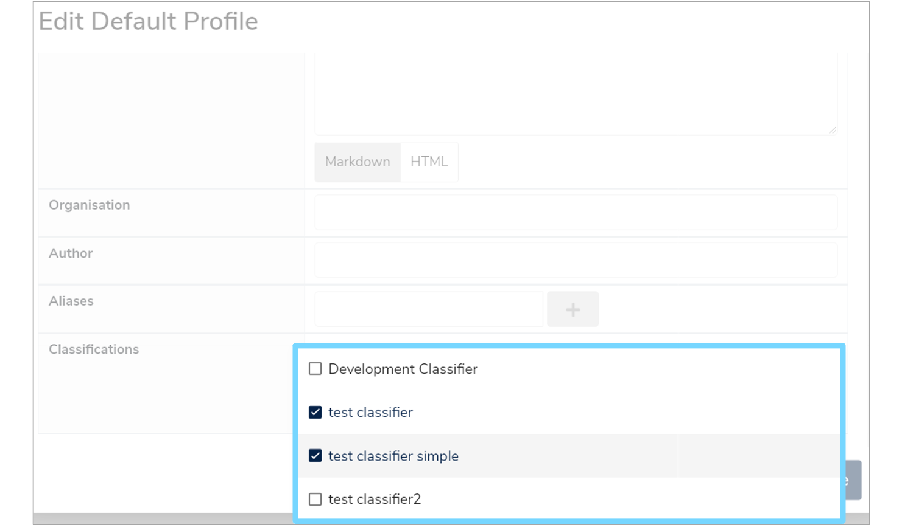
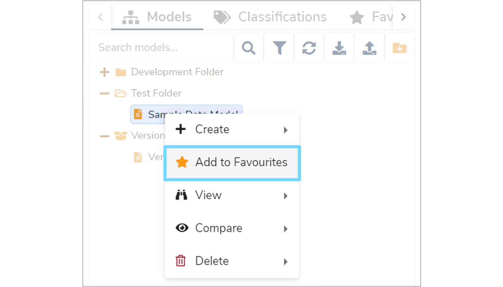
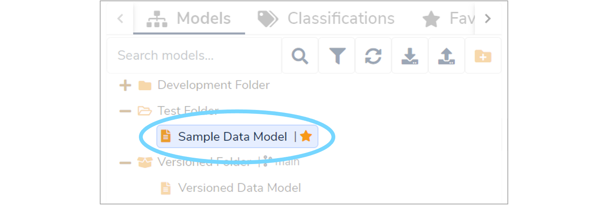
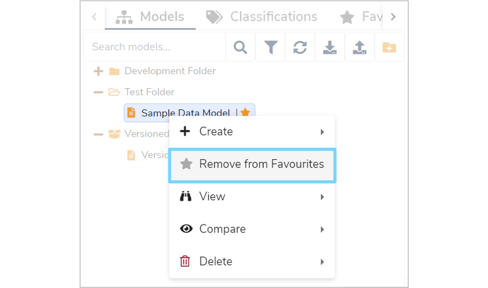
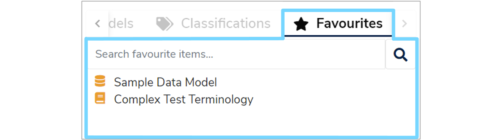

This user guide summarises how to organise [Data Models](../../glossary/data-model/data-model.md) including rearranging folders, adding classifiers and selecting favourites. 

---

## 1. Overview

There are three ways to organise **Data Models** in a Mauro catalogue:

1. Folders
2. Versioned Folders
3. Classifiers

### 1.1 Folder

A [folder](../../glossary/folder/folder.md) is a container that can store **Data Models** and other folders.

### 1.2 Versioned folders

A [versioned folder](../../glossary/versioned-folder/versioned-folder.md) shares the same properties as a folder but also shares additional properties typically used by a **Data Model**. A versioned folder is able to store models and/or folders, but can also be version controlled like a **Data Model**. This means that the entire folder can be:

* [Finalised](../../glossary/finalise/finalise.md)
* [Branched](../../glossary/branch/branch.md)
* [Versioned](../../glossary/version/version.md)
* [Forked](../../glossary/fork/fork.md)
* [Merged](../../glossary/merging/merging.md)

Finalising a versioned folder is the same as finalising every single, individual model within that folder, but in one action.

### 1.3 Classifier 

A [Classifier](../../glossary/classification/classification.md) is a container type which acts like a tag on a catalogue item. A **Classifier** can be attached to one or more catalogue items, such as models, as a way of grouping items together.

---

## 2. Create a folder

To find out how to create a folder see section ['1. Create a new Folder'](../create-a-data-model/create-a-data-model.md#create-a-new-folder) of our ['Create a Data Model' user guide](../create-a-data-model/create-a-data-model.md).

These instructions apply to both folders and versioned folders, as both are the same in this case.

---

## 3. Create a Classification

To create a **Classifier** make sure the **'Classifications'** tab above the **Model Tree** is selected. Then click the **'Create a new Classification'** icon to the right of the **'Search classifications'** box.

This will bring up a **'Create a new Classifier'** dialogue box. Enter a **Classifier** name ([Label](../../glossary/label/label.md)) and click **'Add Classifier'**.

---

## 4. Moving folders

To move a folder or a versioned folder, left click and hold on the relevant folder in the **Model Tree**. You can then drag this folder into either another folder, versioned folder or into the top level dropzone that appears. Once the folder has been dragged to the desired location and the top level folder is highlighted, release the left mouse button to confirm the action. 

There are some restrictions on moving versioned folders. Firstly, a versioned folder cannot be dragged into another versioned folder. Secondly, items cannot be dragged into versioned folder that are finalised.

---

## 5. Adding to folders

Catalogue items can be created in folders and versioned folders in a number of different ways. 

### 5.1 Create menu

Right click on the relevant folder or versioned folder and then hover over the **'+ Create'** option that appears at the top of the menu. A secondary menu will then appear, from which you can add another **'Folder'**, **'Data Model'** or **'Code Set'**.

### 5.2 Drag items

In a similar way to moving folders, you can also move existing catalogue items into both folders and versioned folders by dragging them. Left click and hold on the item you wish to move in the **Model Tree**. Drag it to the desired location and once highlighted, release the left mouse button.  

### 5.3 Import 

You can also import **Data Models** into folders and versioned folders. To find out how to do this from an Excel spreadsheet, see our ['Import a Data Model from Excel' user guide](../import-data-model-from-excel/import-data-model-from-excel.md).

---

## 6. Adding to Classifiers

To add a catalogue item to a **Classifier**, select the relevant item in the **Model Tree**. The description panel will then display on the right hand side of your screen. Under the **'Description'** tab, click the **'Edit'** button and then select **'Edit'** from the dropdown menu.

This will bring up an **'Edit Default Profile'** form. In the **'Classifications'** field, tick the classifiers from the dropdown menu that you would like to associate with this item. Once you've selected all the relevant classifiers, click **'Save'** to confirm your changes.

---

## 7. Add, remove and view Favourites

To easily access catalogue items, you can mark them as **Favourites**. To do this, right click on the catalogue item in the **Model Tree** and then select the **'Add to Favourites'** option in the menu.

This will add a star to the right of the catalogue item name in the **Model Tree**.

To remove a catalogue item from your favourites list, right click on the catalogue item in the **Model Tree** and then select **'Remove from Favourites'** from the menu.

To view a list of all the catalogue items that have been bookmarked as favourites, select the **'Favourites'** tab above the **Model Tree**.

---