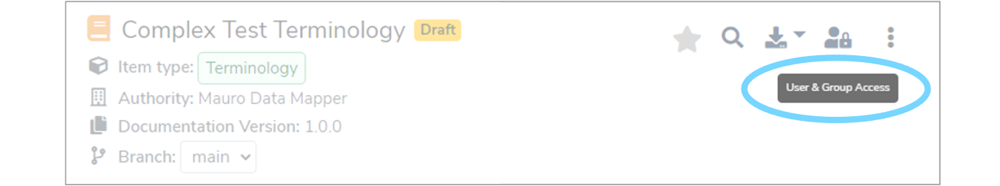
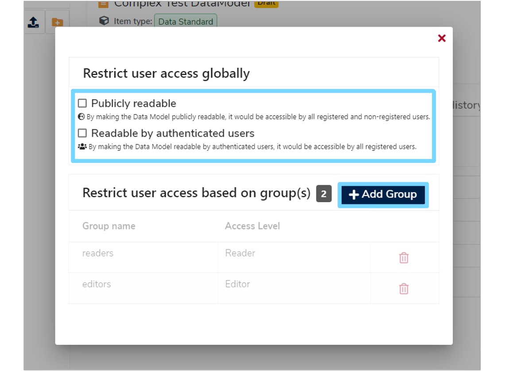
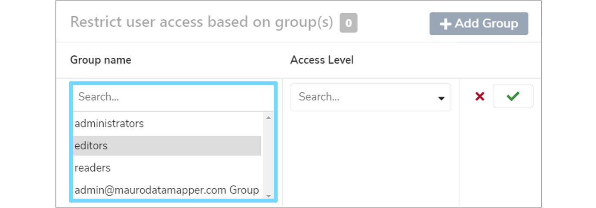
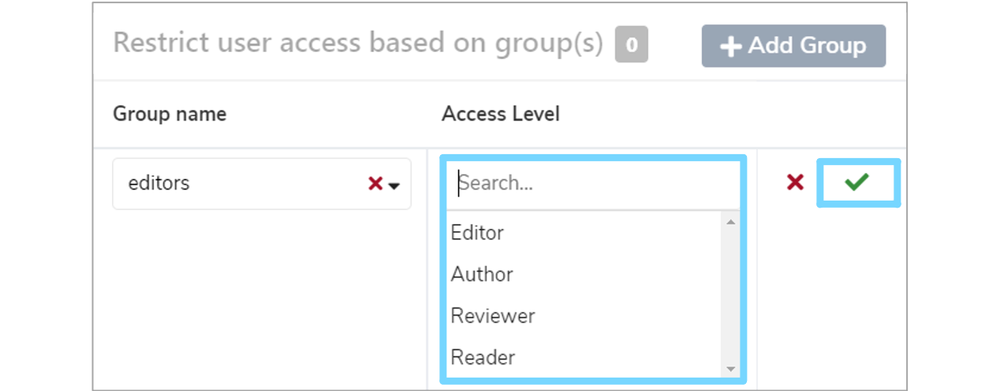
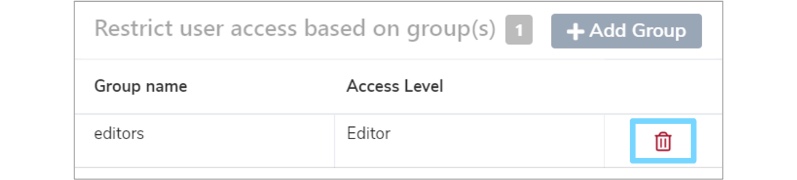

This user guide explains the multiple levels of access to catalogue items and adminstration supported in **Mauro Data Mapper**. 

---

## 1. Access levels

In total there are six different access levels within Mauro. These are divided into Model roles, Container roles and Application roles. 

Each level along with it's permissions are summarised below in ascending order. 

### Reader
* Read models

### Reviewer
* As **Reader** (above) plus:
* Add comments

### Author
* As **Reviewer** (above) plus:
* Add and edit descriptions

### Editor
* As **Author** (above) plus:
* Create models
* Edit model structures
* Mark models as 'deleted'

### Container Administrator
* As **Editor** (above) plus:
* Permanently delete models

### Container Group Administrator
* As **Container Administrator** (above) plus:
* Add container groups
* Assign groups to containers
* Add users to container groups
* Remove users from container groups

---

## 2. Users

Users can be created in Mauro to control authenticated access to the catalogue. Some or all of the catalogue may be made publicly available, which means that anonymous users may view the contents. However, for any non-public content an authenticated user can only see that catalogue content.

When a new Mauro instance is created, a default administrator account will be created to allow you administration access and manage further users. By default this account is:

**Username:** admin@maurodatamapper.com

**Password:** password

!!! Warning
    Please change this password **as soon as possible** to avoid security issues. To find out how to change your password see section ['4. Change your password'](../user-profile/user-profile.md#change-password) of our ['User profile' user guide](../user-profile/user-profile.md).

An administrator is then able to manage and create further users in Mauro via the administrator dashboard. See section ['4. Manage users'](../admin-functionality/admin-functionality.md#manage-users) of our ['Admin functionality' user guide](../admin-functionality/admin-functionality.md) to find out how to do this.

To differentiate user access levels and determine what each user is allowed to action, each user should be assigned to one of these groups:

* **Readers**
* **Editors**
* **Administrators**

---

## 3. Groups

Groups are used to manage collections of users and their permissions as a whole. Each Mauro instance is created with the following core user groups defined:

* **Readers**  
	Users are only able to read the Mauro catalogue content and cannot modify anything.

* **Editors**  
	Users can read and modify the Mauro catalogue content, but are not able to perform administrative actions, such as creating new users.

* **Administrators**  
	Users are able to perform any action in Mauro, including reading and modifying content and administration tasks.

Each user should be placed into one of these groups initially to govern what **permissions** they have, such as:

* Read access
* Write access
* Delete access, etc

A user can belong to more than one group, in which case the permissions for each group are then combined. Further groups can also be created to define logical collections of users together. To find out how to manage groups, see section ['6. Manage groups'](../admin-functionality/admin-functionality.md#manage-groups) of our ['Admin functionality' user guide](../admin-functionality/admin-functionality.md).

Groups can then be used to assign access to particular catalogue items for a collection of users as a whole, as explained in the next section.

---

## 4. Catalogue items

Catalogue items can be restricted to be globally accessible to allow them to be either:

* Fully public 
* Accessible to authenticated users only 
* Accessible only to certain groups of users 

These restrictions can be placed on:

* [Folders](../../glossary/folder/folder.md)
* [Data Models](../../glossary/data-model/data-model.md)
* Code Sets
* Terminologies
* Reference Data Models

These permissions also propogate down the catalogue item hierarchy. For instance, if a folder were made **'Publicly available'**, then all models and sub-folders within it would automatically become **'Publicly available'** as well.

---

## 5. Manage User and Group Access

Only **Editors** can manage the user and group access. To do this, select the relevant **Data Model** or **Folder** in the **Model Tree**. Then click the **'User & Group Access'** button at the top right of the details panel.

 
This will bring up a **'Restrict user access globally'** dialogue box. Here you can select whether you would like the model or folder to be **'Publicly readable'**, **'Readable by authenticated users'** or **'Restrict user access based on groups'**.

### 5.1 Publicly readable

Any catalogue item made publicly readable allows anyone to view it, whether they are an anonymous or registered user. This is useful when building a catalogue for public consumption.

Note that although catalogue items may be publicly readable, only authenticated users in the **Editors** group or higher are able to modify those catalogue items.

### 5.2 Authenticated users

Any catalogue item made readable by authenticated users guarantees that only registered users can view this item. This is useful when building an internal catalogue for an organisation and viewing access must be governed by an administrator to manage users.

Again, only users in the **Editors** group or higher can modifiy these catalogue items.

### 5.3 Group access

Zero or more user groups may be assigned to a catalogue item to control which collection(s) of users may view the catalogue item. This allows a further level of control compared to the **'Authenticated users'** option.

To add group access to a catalogue item, click the **'+Add Group'** button on the **'Restrict user access globally dialogue box'**. This will add a row to the group list that you will then need to populate. 

First, you need to select a **group name** which determines the **collection** of users to allow. Click the **'Search...'** box under **'Group name'** and select the relevant group from the dropdown menu.

You then need to select which **access level** you would like to assign to the group. This determines what the collection of users are capable of doing to this catalogue item. Available access levels are listed below, with the permissions of each detailed in ['1. Access levels'](#access-levels).

  * **Reader**
  * **Reviewer**
  * **Author**
  * **Editor**
  * **Container Administrator** (Folders only)
  * **Container Group Administrator** (Folders only)

Once you've decided on a suitable **access level**, click the **'Search...'** box under **'Access Level'** and select the relevant access option. Then click the green tick to the right of the row to save your changes.

You can remove group access from a catalogue item by clicking the red bin to the right of the group you wish to remove. 

---