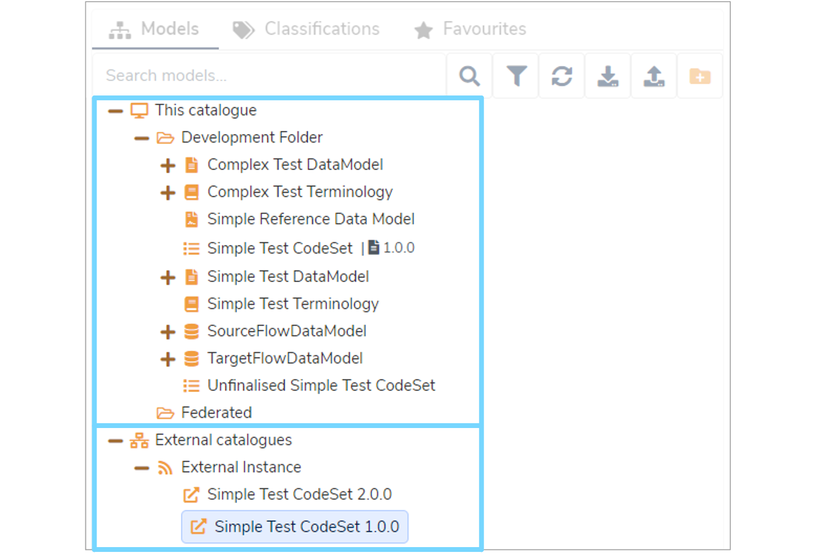

**Mauro Data Mapper** instances are able to provide an Atom feed that publishes all finalised versions of [Data Models](../../glossary/data-model/data-model.md) in the catalogue. 

This enables other **Mauro Data Mapper** instances to **subscribe** to these feeds and view the **Federated Data Models** available from external catalogues. 

Furthermore, a **Mauro Data Mapper** instance has the ability to **subscribe** to one or more of these **Federated Data Models** to import them into their own catalogues. This user guide will explain how. 

---

## 1. Feeds and API Keys

All **Mauro Data Mapper** server instances expose the URL `api/feeds/all` which returns the Atom syndication data. For another server instance to view all available data in that feed, each server instance must generate an **API key** and provide it to the required external parties. 

### 1.1 Create or copy an API Key

API keys may be set up through the web interface or via the API. To create an API key, you must be logged in with a username and 
password.

On the top right of the menu header, click the white arrow next to your user profile and select **'API keys'** from the dropdown menu.

This will take you to a list of existing API keys that belong to you. Here, you can enable or re-enable existing keys by clicking the three vertical dots to the right of each item in the list. This dropdown menu also allows you to delete keys.

For each API belonging to the user, the list displays:

* **Name**  
  This is a human readable name for each API key, which must be unique for each user. Users can use the name to differentiate between different keys 
  used for different purposes.
 
* **Key**  
  This is the key itself, which is a UUID, unique to this user. 

* **Expiry date**  
  This is the date from which the API key will no longer be valid. For security purposes, every API key is given an expiry date, but may be 
  **'refreshed'** before expiry.
  
* **Refreshable**  
  Specifies whether an API key can be refreshed once expired.

* **Status**  
  Details whether an API key is **'Active'** or **'Disabled'**.

You can either copy an existing key value or create a new one to provide to an external party. 

To copy the key value to your clipboard click the **'Copy'** button in the relevant **'Key'** box. To create a new API key, click the **'Create Key'** button at the top right of the list. This will open a **'Create an API Key'** form which you will need to complete.

Enter the human-readable name of the API key (as described above), choose a number of days before expiry and select whether the key is to be refreshable on expiry or not. Once completed, click **'Create Key'** to confirm your changes.

For more information about creating and managing API Keys, please see the [API Keys page](../../../rest-api/apikeys) in the REST API documentation 

---

## 2. Add a Subscribed Catalogue

> Note: The following can only be carried out by an administrator. 

Administrators can manage the set of **Subscribed Catalogues** a **Mauro Data Mapper** instance connects to. To manage the catalogues, click the white arrow next to your user profile and select **'Subscribed catalogues'** from the dropdown menu.

This will take you to a list of existing catalogues. Here you can test, edit and delete catalogues by clicking the three vertical dots to the right of each item in the list which will display a dropdown menu.

For each existing catalogue, the list displays:

* **Label**  
  A unique label to help identify the subscribed catalogue.
 
* **Description**  
  A description to help explain what the subscribed catalogue is for.

* **URL**  
  The URL to the server instance to connect to.
 
* **API Key**  
  The generated key value to authenticate against the server instance.

* **Refresh period**  
  State how often, in days, this server instance should refresh the subscribed catalogue feed to check for new data. If not provided, a suitable default will be used instead.

To add a **Subscribed Catalogue**, you will need:

*  The URL to the **Mauro Data Mapper** server instance to connect to.
*  The API key to authenticate on that server instance.

> Note: The URL only needs to refer to the instance and not the absolute URL to the Atom feed.

Click the **'+Add'** button at the top right of the **'Catalogues'** list. This will open an **'Add Subscribed Catalogue'** form which you will need to complete.

Enter the label, description, URL, API Key and refresh period as described above. Once completed, click **'Add subscription'** and a green notification box should appear at the bottom right of your screen confirming that the **'subscribed catalogue saved successfully'**. 

--- 

## 3. Federated Data Models

When at least one subscribed catalogue has been configured, any signed in user may be able to view the **Federated Data Models** from those catalogues in the **Model Tree**.

The **Model Tree** will be updated to list two new root nodes:

* **This catalogue**  
  Lists all the folders and **Data Models** contained within this **Mauro Data Mapper** instance.
  
* **External catalogues**  
  Lists each subscribed catalogue created for this **Mauro Data Mapper** instance. Expanding each subscribed catalogue will list all readable **Federated Data Models** that can be individually subscribed to.

### 3.1 Subscribe to a Federated Data Model

You can view the subscription status of a **Federated Data Model** by selecting the relevant model in the **Model Tree** which will display it's details panel. 

To subscribe to a **Federated Data Model** so that it is included in the current catalogue, click **'Subscribe'** and a **'Subscribe to Data Model'** dialogue box will appear.

Click the menu icon to the right of the box to display the **Model Tree**. Select the folder you wish to import the **Federated Data Model** into and click **'+Subscribe'**. The status of this model will now change to **'Subscribed'** in the details panel, meaning that this catalogue will automatically maintain this subscription until the user chooses to unsubscribe.

### 3.2 Imported Federated Data Models

Once subscribed to, each **Federated Data Model** will be automatically imported into the current **Mauro Data Mapper** catalogue at the chosen target folder, including the links between model versions.

It is possible to manually synchronise the subscribed catalogues. To do this, select the subscribed catalogue in the **Model Tree**. In the relevant details panel, click the **'Synchronise'** button.

Each subscribed catalogue will also list version updates when the current **Mauro Data Mapper** instance refreshes the Atom feed, the frequency of which is determined during configuration. New versions of a **Data Model** will appear with their updated versions listed for you to also subscribe to, which is a manual operation.

---