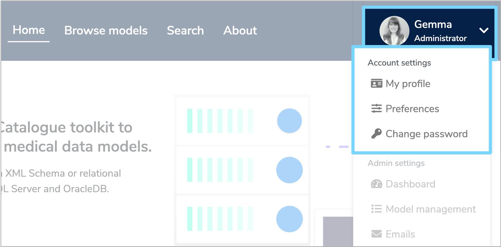
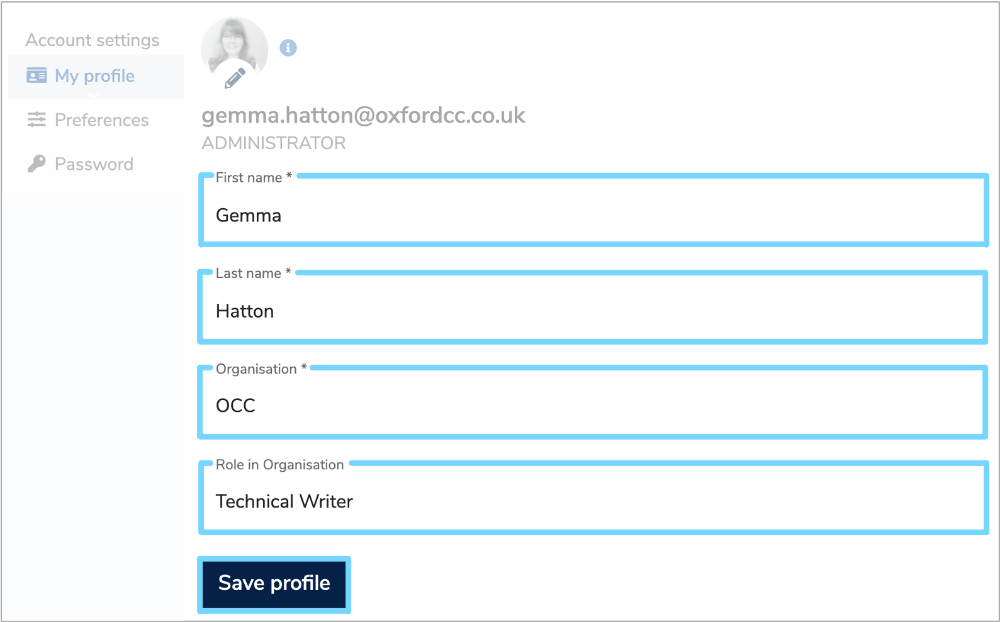
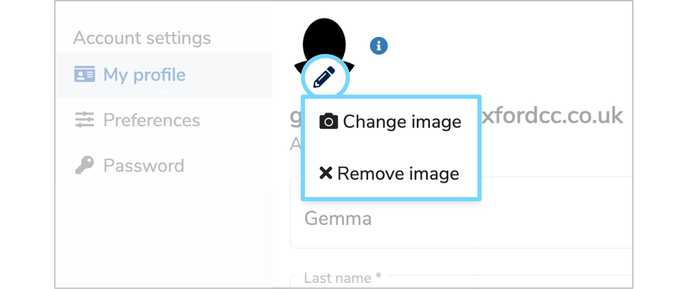

This user guide will show you how to add and edit information in your user profile.

---

## 1. Edit your profile

When logged in to **[Mauro Data Mapper](https://modelcatalogue.cs.ox.ac.uk/mdm-ui/#/home)**, your user profile is displayed on the top right of the menu header. Click the white arrow and a dropdown menu will appear. The options available in this menu will depend on whether you are an **'Editor'** or an **'Administrator'**. 

To edit your profile, select the **'My profile'** option from the dropdown menu. This will take you to a page displaying your details, with the compulsory fields (indicated by *) completed according to the information entered when you were registered. 

* **First and last name**  
	This is used for identification.

* **Organisation**  
	This allows other **[Mauro Data Mapper](https://modelcatalogue.cs.ox.ac.uk/mdm-ui/#/home)** users to know which organisation you belong to.

* **Role in Organisation**  
	This allows other **[Mauro Data Mapper](https://modelcatalogue.cs.ox.ac.uk/mdm-ui/#/home)** users to know your role within your organisation.

Once you have amended your details, click **'Save profile'** and your changes will be updated.

---

## 2. Change your profile picture

To add or edit your profile picture, navigate to the **'My profile'** page and click the pencil icon on your profile picture. A dropdown menu will appear with the option to either **'Change image'** or **'Remove image'**. 

To add or change the image for your profile picture, select **'Change image'** and the file explorer on your computer will open. Navigate to the image you would like to use for your profile, select it and then click **'Open'**. 

The image will then be imported into your **'My profile'** page, with a preview displayed on the right. You can then resize the image by hovering over the corners of the highlighted box until an arrow appears. Click and hold the left mouse button and drag the box until it is the desired size. 

To drag the entire highlighted box, hover your cursor inside the box until the 4 headed arrow appears. Click and hold the left mouse button until the box is in the desired location. 

Once you have finished adjusting your profile picture, click **'Update profile image'** and a notification will appear on the bottom right of your screen to confirm the update. Then click **'Save profile'** to save all changes.

To remove a profile picture, click the pencil icon and select **'Remove image'** from the dropdown menu. Again, a notification will appear at the bottom right of your screen to confirm the change and then click **'Save profile'**.  

<iframe src="https://player.vimeo.com/video/507538609" width="640" height="397" frameborder="0" allow="autoplay; fullscreen" allowfullscreen></iframe>

---

## 3. Update preferences

You can also specify some interface preferences that are permanently saved to your user profile. To do this, navigate to the **'Preferences'** page on your user profile and choose the options that suit you. 

* **Number of records per table**  
	By default this is set to 20. However depending on screen size, you may wish to view 5, 10 or 50, in which case select the most suitable option. 

* **Always expand descriptions**  
	The next option allows descriptions to be expanded automatically, regardless of the character count. This is unchecked by default. However, those with larger screens may prefer to always expand descriptions in tables. If so, check this box.  

* **Include Superseded Document Models in Data Model Tree**  
	The final option determines whether you want the **Finder Panel** to show superseded document models within the **Data Model Tree view**. This is unchecked by default as typically these models represent invalid or outdated descriptions. However, feel free to check the box to change this. 

Once you have selected all your preferences, click **'Save preferences'** and these will now be saved for future sessions.

image

---

## 4. Change your password

---