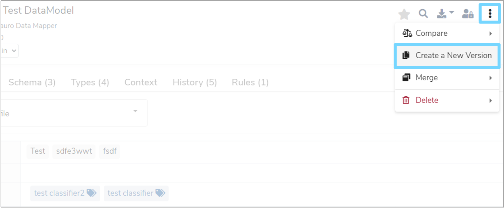
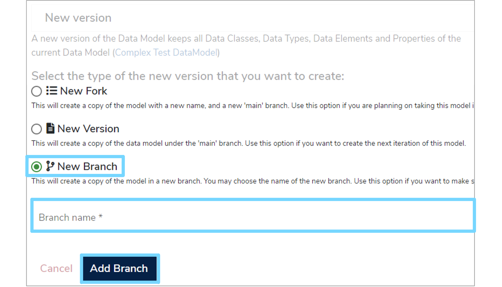
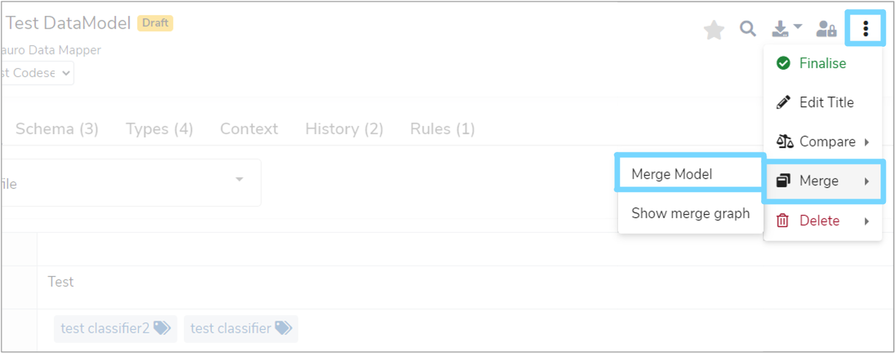
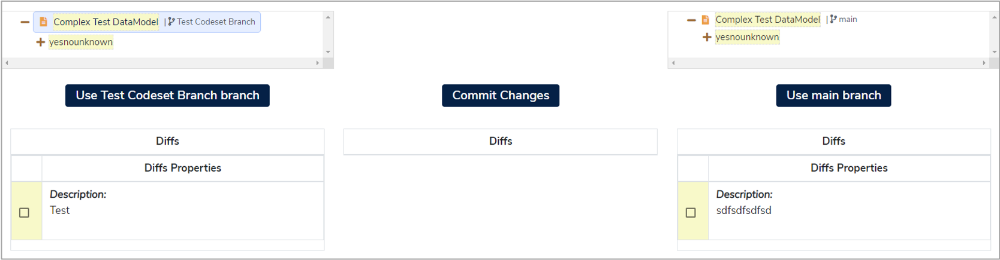
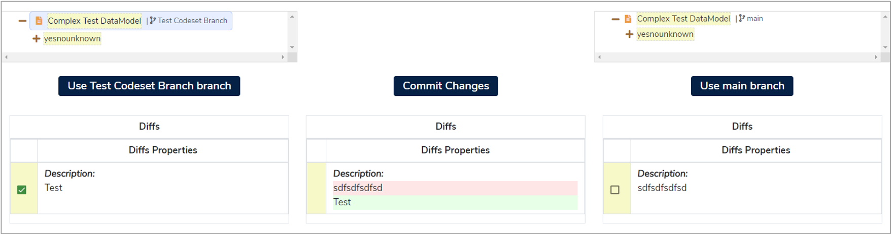
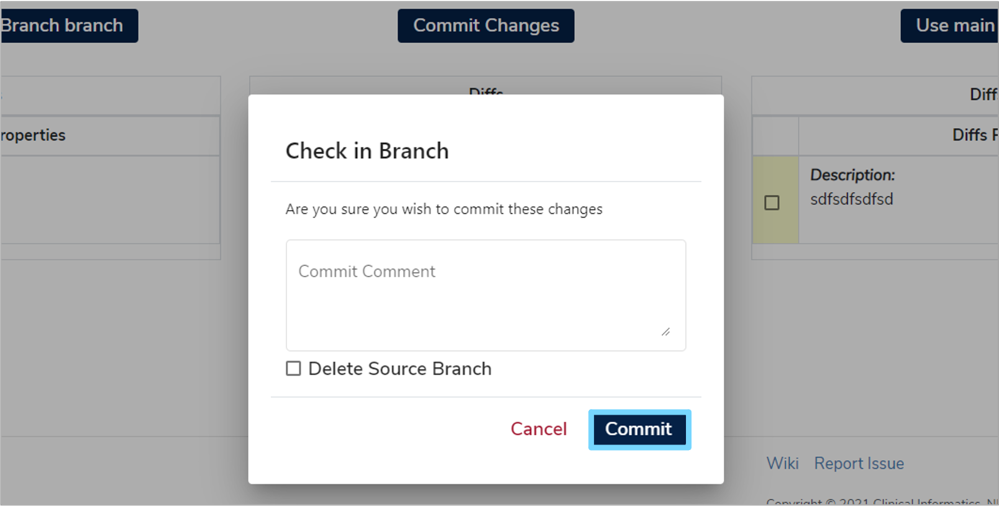

This user guide will show you how to create working versions of [Data Models](../../glossary/data-model/data-model.md) as well as how to merge completed **Data Models** into the main branch. This ensures that you can make changes without adversely affecting other users of **Mauro Data Mapper**.

---

## 1. Versioning

**Data Models** can only be versioned if they meet the below criteria: 

* The **Data Model** must be finalised
* The **Data Model** must have a version number

If your **Data Model** satisfies both of these conditions, then you will be able to create a new version. To do this, highlight the relevant **Data Model** in the **Model Tree** and click the three vertical dots at the top right of the details panel. Select **'Create a New Version'** from the dropdown menu.

You will then be presented with three options: 

* **New Fork**  
	This will create a copy of the **Data Model** with a new name and a new **'main'** branch. Use this option if you are planning on taking this model in a new direction, or under a new authority.

* **New Version**  
	This will create a copy of the **Data Model** under the **'main'** branch. Use this option if you want to create the next iteration of this model.

* **New Branch**  
	This will create a copy of the **Data Model** in a new branch, which you can choose the name for. Use this option if you want to make some changes that you subsequently wish to merge back into **'main'**.

### 1.1 New Branch

For this user guide, we will select **'New Branch'**. A text box will then appear where you can enter a **'Branch name'**. This will distinguish your **Data Model** from the others in your **Data Model** family. 

Once completed, click **'Add Branch'**. This will create a copy of the **Data Model** for you to edit. If this is the first branch, then a **'main'** branch will also be created. This will be the branch that changes from other branches will be merged into. 

---

## 2. Merging

To merge completed changes of a **Data Model** into the main branch, click the three vertical dots at the top right of the details panel. Select **'Merge'** from the dropdown menu and then click **'Merge Model'**.

This will take you to a merge screen which is split into three columns. The left column shows the source branch which you are merging from. The middle column displays the items to be merged and the right column shows the items currently on the main branch.

The right and left columns will display a tree which represents the **Data Model** and its changes. There are three types of possible changes which are represented by different colours:

* **Addition - Green**  
	This is a change present on the source branch but isn’t currently on the target branch. These types of changes will usually be auto merged and therefore won’t need selecting.

* **Modification - Yellow**  
	This is a change to an item which is present on both the source and target branches. These changes aren’t normally auto merged and therefore will require selection by the user.
	
* **Deletion - Red**  
	These changes will remove items from the main branch. These are never auto merged and will require selection by the user.
	
As changes can be made to different items within the **Data Model**, it is recommended that you check the tree in the left column to ensure that all the changes you wish to merge are selected.

### 2.1 Property changes

If required changes can be selected from the trees in both the left and right  columns, a new editor window will appear. This allows you to make custom changes and then commit these changes to the main branch.

### 2.2 Check In

Once all the relevant changes have been selected and are highlighted by a green tick, click **'Commit Changes'**. A new dialogue box will appear where you can enter a check in comment. This is not required but can be useful for future auditing. You also have the option to delete the source branch by selecting the tick box to the left of the **'Delete Source Branch'** option. 

To migrate all the changes to the main branch click **'Commit'** and a green notification box should appear at the bottom right of your screen, confirming that the commit was successful. If the commit was unsuccessful, then a red notification box will appear at the bottom right of your screen. Correct the errors and try again. 

---